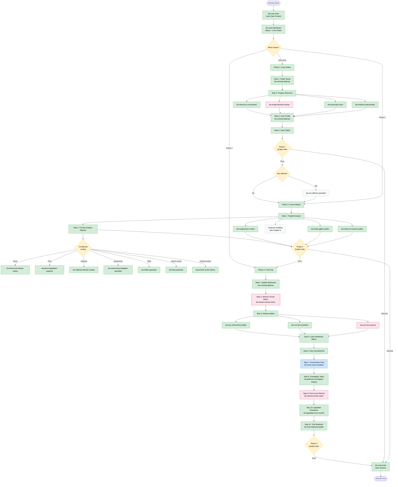

# DW Skill Workflow Guide (v2.0)

A comprehensive, current-state guide to the order, structure, and trigger phrases for the 43 `dw-*` skills installed in Cowork. Use the cheat sheet for quick mid-case reference. Read the full chapters for onboarding or detailed workflow understanding.

> **What changed since v1.0 (April 7, 2026):**
> - Removed deprecated skills no longer in the toolkit: `dw-skill-index`, `dw-timeline-builder`, `dw-client-communication-drafter`, `dw-billing-narrative-generator`, `dw-case-tracker-updater`, `dw-witness-statement-analyzer`, `dw-case-disposition`, `dw-post-conviction-relief`, `dw-drug-offense-specialist`, `dw-dwi-specialist`, `dw-firearms-specialist`, `dw-data-contracts`, `dw-exhibit-manager`.
> - Added new skills: `dw-witness-threat-matrix` (Phase 3 capstone), `dw-jury-focus-group` (mock jury simulation), `dw-image-filename-stamp` (evidence/exhibit prep), `dw-pi-video-generator` (marketing).
> - Restructured Phase 3 around the Witness Threat Matrix → Cross-Exam Architect feedback loop.
> - Replaced offense-specific appendices with a single Sex Offense Framework appendix (the only offense-specific specialist still in the toolkit).

---

## Quick-Reference Cheat Sheet

### Phase 0 — Session Management

| Step | Skill | Trigger Phrase | Inputs Needed |
|------|-------|----------------|---------------|
| Load existing case | `dw-case-brain` | "load the case" / "pick up where we left off" | Client name or docket number |
| Check case status | `dw-case-dashboard` | "where do we stand" / "case status" / "next hearing" | Loaded case context |
| Save & wrap session | `dw-case-brain` | "save the session" / "wrap up" | Active session state |

### Phase 1 — Case Intake & Matter Setup

| Step | Skill | Trigger Phrase | Inputs Needed |
|------|-------|----------------|---------------|
| 1. New case / folder setup | `dw-criminal-defense` | "new case" / "case intake" | Confirmed client engagement |
| 2a. Triage incoming discovery | `dw-discovery-orchestrator` | "new discovery" / "triage discovery" | Raw discovery files |
| 2b. Bate stamp documents | `dw-criminal-defense` | "run Phase 1" | Organized discovery files |
| 2c. Stamp evidence images | `dw-image-filename-stamp` | "stamp the images" / "label the photos" | Folders of image files |
| 2d. Transcribe recordings | `dw-transcript-router` | "transcribe the evidence" / "process the recordings" | Audio/video files |
| 2e. Cross-case DMAR (co-d) | `dw-dmar-synthesizer` | "compare the DMARs" / "co-defendant comparison" | Multiple DMAR outputs |
| 2f. Evidence placeholders | `dw-evidence-placeholder` | "evidence placeholders" / "catalog the media folders" | Media folders in `05 - Evidence` |
| 3. Generate Case Profile | `dw-criminal-defense` | "run Phase 1" | Organized discovery, court filings |
| 4. Build Case Tables | `dw-criminal-defense` | "run Phase 1" | Evidence folder, Case Profile |

### Phase 2 — Case Processing & Analysis

| Step | Skill | Trigger Phrase | Inputs Needed |
|------|-------|----------------|---------------|
| 1. Parallel analysis | `dw-criminal-defense` | "run Phase 2" | Completed Phase 1 |
| 1a. Constitutional scan | `dw-suppression-motion` | "motion to suppress" / "audit the warrant" | Flagged 4th/5th Amendment issues |
| 1b. Brady/Giglio check | `dw-brady-giglio-auditor` | "run Brady audit" / "Giglio" | Evidence Table |
| 1c. Chain of custody | `dw-chain-of-custody-auditor` | "audit chain of custody" / "broken chain" | Physical evidence items |
| 2. Evidence auditing | See Chapter 6 | — | Varies by evidence type |
| 3. 9 Case Analysis Reports | `dw-criminal-defense` | "run Phase 2" | All discovery + parallel analysis |
| 3→7. Auto: demand letter | `dw-brady-giglio-auditor` | (auto-triggered) | Report 7 output |
| 3→9. Auto: impeachment | `dw-cross-exam-architect` | (auto-triggered) | Report 9 output |

### Phase 2 — Conditional Routing

| Condition | Skill | Trigger Phrase | Inputs Needed |
|-----------|-------|----------------|---------------|
| Bond concerns | `dw-bond-and-release-motion` | "bond reduction" / "PR bond" | Report 3/5 findings |
| Plea offer on table | `dw-plea-negotiation-analyzer` | "analyze the plea offer" / "trial exposure" | Offer terms, case strength |
| Habitual exposure | `dw-habitual-offender-auditor` | "audit the habitual bill" / "529.1" | Prior conviction records |
| Sentencing concerns | `dw-sentencing-mitigation-specialist` | "build sentencing mitigation" / "PSI report" | Client background |
| 404(b)/Prieur notice | `dw-404b-opposition` | "oppose the 404(b)" / "Prieur notice" | Prieur notice |
| Sex offense charged | `dw-sex-offense-specialist` | "rape shield" / "Art. 412" / "SANE exam" | Charges, SANE/CAC evidence |
| Pretrial motion needed | `dw-pretrial-motion-library` | "speedy trial" / "motion to compel" / etc. | Case facts |
| LWOP review (homicide/sex) | `dw-lwop-populator` | "LWOP sheet" / "District Defender review" | Discovery PDFs |

### Phase 3 — Trial Notebook & Attorney Preparation

| Step | Skill | Trigger Phrase | Inputs Needed |
|------|-------|----------------|---------------|
| 1. Update witness tables | `dw-criminal-defense` | "run Phase 3" | Reports 8, 9 |
| 2. Witness threat matrix | `dw-witness-threat-matrix` | "witness threat matrix" / "rank the witnesses" | Phase 2 deliverables |
| 3. Defense matrix | `dw-criminal-defense` | "run Phase 3" | Charges, defenses |
| 3a. Jury instructions | `dw-jury-instructions-builder` | "jury instructions" / "verdict form" | Defense Matrix |
| 3b. Voir dire strategy | `dw-voir-dire-assistant` | "prep voir dire" / "Batson" | Charges, venue data |
| 3c. Test defense theory | `dw-jury-focus-group` | "focus group" / "mock jury" / "test my defense" | Defense theory, parish demographics |
| 4. Discovery version control | `dw-discovery-compliance-monitor` | "update the discovery ledger" | Supplemental productions |
| 5. Case readiness memo | `dw-criminal-defense` | "run Phase 3" | All reports + analysis |
| 6. Story development | `dw-criminal-defense` | "run Phase 3" | Reports 4, 6 |
| 7. Cross-exam prep | `dw-cross-exam-architect` | "build a cross for [witness]" | Threat Matrix + Impeachment Worksheets |
| 8. Investigator tasking | `dw-defense-investigator-tasking` | "investigator assignment" / "scene visit" | Open factual gaps |
| 9. Refresh threat matrix | `dw-witness-threat-matrix` | "post-cross refresh" / "rescore the witnesses" | Completed cross outlines |
| 10. Appellate readiness | `dw-appellate-error-monitor` | "preserve error" / "log error" | Rulings, objections |
| 11. Trial notebook assembly | `dw-trial-notebook-builder` | "build the trial notebook" | All Phase 3 deliverables |

### Any Phase — Administrative & Marketing

| Task | Skill | Trigger Phrase |
|------|-------|----------------|
| Investigator tasks | `dw-defense-investigator-tasking` | "investigator assignment" |
| Cross-case DMAR review | `dw-dmar-synthesizer` | "compare the DMARs" |
| Pretrial motions (any type) | `dw-pretrial-motion-library` | See Chapter 8 trigger list |
| PI marketing video | `dw-pi-video-generator` | "PI video" / "TikTok script" / "personal injury video" |

---

## Workflow Diagram



**Legend:**
- **Green nodes:** Cowork-automated steps
- **Pink nodes:** New skills added in v2.0
- **Blue nodes:** Attorney action required
- **Orange diamonds:** Routing decisions / quality gates
- **Gray dashed boxes:** Cross-reference to another chapter

---

## Phase 0 — Session Management

These two skills bookend every working session, regardless of case phase. They are infrastructure — not part of the 3-phase workflow itself, but required for every session.

### dw-case-brain — Memory Layer

The first and last skill invoked in every session.

| | |
|---|---|
| **When** | Start and end of every session |
| **Trigger** | "load the case" / "open the matter" / "pick up where we left off" / "save the session" / "wrap up" |
| **Inputs** | Client name or docket number |
| **Outputs** | **Open:** Loads full case context from Obsidian vault (charges, phase, open issues, session history). **Close:** Writes session delta back to vault. |
| **Key rule** | Always invoked first (loads context) and last (saves progress). Every other skill operates within the context it provides. |

### dw-case-dashboard — Status + Court Calendar

Orients you on where the case stands and pulls upcoming court dates from Google Calendar.

| | |
|---|---|
| **When** | Before starting work on a case |
| **Trigger** | "where do we stand" / "case status" / "what's next" / "upcoming court dates" / "next hearing" |
| **Inputs** | Loaded case context (from case-brain) |
| **Outputs** | Current phase, deliverables found in client folder, upcoming court dates from Google Calendar, recommended next steps |

### How they relate

```
Session Open → case-brain loads context
             → case-dashboard shows status + calendar
             → [work happens using phase-specific skills]
             → case-brain saves session delta
Session End
```

> Note: the v1.0 guide referenced a `dw-skill-index` routing skill. That skill is no longer in the toolkit. To find the right skill, use the trigger-phrase tables in this guide or call `list_skills` in Cowork.

---

## Phase 1 — Case Intake & Matter Setup

*Triggered when a new client engagement is confirmed. Covers everything from folder creation through a fully organized, Bate-stamped, searchable case file with a complete Case Profile.*

**Master skill:** `dw-criminal-defense` — invoke with "new case" or "case intake" to start Phase 1.

### Step 1: Folder Setup

| | |
|---|---|
| **Skill** | `dw-criminal-defense` (Phase 1 trigger) |
| **Inputs** | Confirmed client engagement |
| **Outputs** | Standard folder structure verified (`01 - Trial Notebook` with all sub-tabs, `02 - Pretrial Notebook` with all sub-tabs), `Case Tables.xlsx` located at case root |
| **No specialist skills** | This is structural setup only |

### Step 2: Prepare Discovery for Review

The most skill-dense step in Phase 1. Converts raw discovery into organized, Bate-stamped, searchable, properly-labeled files.

**2a — Triage & Organize Discovery**

| | |
|---|---|
| **Skill** | `dw-discovery-orchestrator` |
| **Trigger** | "new discovery" / "triage discovery" / "discovery arrived" |
| **Inputs** | Raw discovery files from prosecution |
| **Outputs** | Discovery Triage Report with routing recommendations, files sorted into Pleadings and Discovery subfolders, Download Log generated |
| **Note** | Also handles **Delta Discovery Mode** — incremental productions later in case ("new evidence added" / "scan for new items") |

**2b — Bate Stamp Documents**

| | |
|---|---|
| **Skill** | `dw-criminal-defense` (within Phase 1) |
| **Inputs** | Organized discovery files |
| **Outputs** | Sequentially numbered documents, updated Bate Stamp Master Log |
| **Key rule** | Check log for current highest number before stamping. Never restart numbering mid-case. |

**2c — Stamp Image Files with Filenames** *(NEW in v2.0)*

| | |
|---|---|
| **Skill** | `dw-image-filename-stamp` |
| **Trigger** | "stamp the images" / "label the photos" / "Bates-style stamps on images" / "prepare images for production" |
| **Inputs** | Folders of image files (JPG, PNG, TIFF, HEIC, WebP) — typically scene photos, body cam stills, social media screenshots |
| **Outputs** | Stamped images in a `stamped/` subfolder inside each source folder. Originals untouched. EXIF preserved. |
| **When to use** | Evidence review, exhibit preparation, production. Makes individual image filenames legible in compiled exhibit packages. |
| **Not for** | PDF Bates stamping (use Adobe Acrobat or DocReviewPad). Date/time overlays (the stamp is filename-only). |

**2d — Transcribe Interviews & Digital Media**

| | |
|---|---|
| **Skill** | `dw-transcript-router` |
| **Trigger** | "transcribe the evidence" / "process the recordings" / "transcribe the body cam" / "transcribe the interview" |
| **Inputs** | Audio/video files in client folder |
| **Outputs** | Transcript PDFs named identically to source A/V files; Defense Media Analysis Report (DMAR) with cross-references, Miranda detection, leading question flags |
| **Routing** | Calcasieu Parish → `dw-transcript-pipeline-calcasieu` (JusticeText). All other parishes → `dw-transcript-pipeline-rev` (Rev.com). |

**2e — Cross-Case DMAR Synthesis (co-defendant cases)**

| | |
|---|---|
| **Skill** | `dw-dmar-synthesizer` |
| **Trigger** | "compare the DMARs" / "co-defendant comparison" / "consolidate DMARs" / "cross-reference co-defendant evidence" |
| **Inputs** | Multiple DMAR transcript files from co-defendant or joined cases |
| **Outputs** | Consolidated inconsistency matrix, cross-case witness comparison, unified defense intelligence brief |
| **When to use** | Co-defendants, joined cases, multiple cases involving overlapping witnesses or events |

**2f — Digital Evidence Placeholders**

| | |
|---|---|
| **Skill** | `dw-evidence-placeholder` |
| **Trigger** | "evidence placeholders" / "catalog the media folders" / "evidence folder inventory" |
| **Inputs** | Media folders (photos, videos, audio, body cam) in `05 - Evidence` |
| **Outputs** | One-page placeholder PDF per media folder with file count, type breakdown, and storage path |

### Step 3: Generate Case Profile

| | |
|---|---|
| **Skill** | `dw-criminal-defense` (continues Phase 1) |
| **Inputs** | All organized discovery, court filings, Clio intake data |
| **Outputs** | `000 - Case Profile.docx` saved to `Pretrial Notebook → 03 - Case Analysis & Notes` |
| **Contains** | Case identification, charges & exposure with La. R.S. citations, arraignment & bail, case-specific defenses grounded in actual evidence, client background (attorney completes), key dates & next steps |

### Step 4: Build Case Tables

| | |
|---|---|
| **Skill** | `dw-criminal-defense` (continues Phase 1) |
| **Inputs** | Completed evidence folder, Case Profile |
| **Outputs** | Three sheets populated in `Case Tables.xlsx` (never create new sheets) |

| Sheet | Contents | Key Columns |
|-------|----------|-------------|
| Evidence Table | Full discovery catalog | Doc #, Evidence Type, Name, Description, Bate Stamp, Reviewed, Notes, Discovery Set, Date, **Review Priority** (AI), **Defense Relevance** (AI) |
| Witness List - Priority | Ranked by witness impact | Name, Witness Type, Association, Sources (Bate stamps), Trial Exam Prepared |
| Witness List - Alpha | Same data, alphabetical | Same columns as Priority |

### Phase 1 Quality Gate

Before advancing to Phase 2, confirm:

- [ ] Folder structure confirmed — all standard subfolders exist
- [ ] Discovery fully organized, Bate-stamped, OCR'd, transcribed
- [ ] Image evidence folders stamped where exhibit prep is anticipated
- [ ] Digital evidence placeholder exists for every media folder
- [ ] `000 - Case Profile.docx` complete with all auto-populated fields
- [ ] Evidence Table: all 11 columns populated, row count matches file count
- [ ] Witness Tables (Priority and Alpha) populated

### Supplemental Discovery (Any Time)

When new discovery arrives after Phase 1 is complete:
- `dw-discovery-orchestrator` — triage and route new files (Delta Discovery Mode)
- `dw-discovery-compliance-monitor` — track State's compliance with disclosure obligations
- Re-run Bate stamping and Evidence Table updates as needed

---

## Phase 2 — Case Processing & Analysis

*Runs parallel analysis before attorney review. Auto-actions from Reports 7 and 9 eliminate rework in Phase 3.*

**Master skill:** `dw-criminal-defense` — invoke with "run Phase 2" after Phase 1 Quality Gate passes.

### Step 1: Parallel Analysis

Cowork independently analyzes all case documents and routes findings to specialists.

| Finding | Routed To | Trigger |
|---------|-----------|---------|
| Constitutional issues (4th/5th/6th Amendment) | `dw-suppression-motion` | "motion to suppress" / "audit the warrant" / "Franks" |
| Undisclosed favorable material | `dw-brady-giglio-auditor` | "run Brady audit" / "Giglio" / "reveal the deal" |
| Custody chain gaps for physical evidence | `dw-chain-of-custody-auditor` | "audit chain of custody" / "broken chain" / "spoliation" |

**Inputs:** Completed Phase 1 — all evidence organized, Case Profile, Case Tables populated.
**Outputs:** Parallel analysis reports saved to `01 - Trial Notebook/09 - Case Analysis/Cowork Analysis/`

> Cross-witness inconsistency mining is no longer triggered as a separate Phase 2 step — it now happens inside `dw-witness-threat-matrix` in Phase 3, which feeds `dw-cross-exam-architect`.

### Step 2: Evidence-Type Routing

Identify what evidence types exist in the case and route to the appropriate auditing skills. **See Chapter 6 for the full Evidence Auditing Reference.**

| If the case contains... | Route to | Chapter 6 Section |
|-------------------------|----------|-------------------|
| Cell phone extraction | `dw-mobile-forensic-auditor` → then `dw-forensic-dump-analyzer` | Digital Device Evidence |
| Body cam / dash cam / CCTV / interview-room video | `dw-video-evidence-auditor` | Video & Surveillance |
| Cell tower / GPS / geofence / tower dump / Stingray | `dw-cell-site-geolocation-auditor` | Location & Communications |
| Social media evidence | `dw-social-media-auditor` | Location & Communications |
| Crime scene processing | `dw-crime-scene-auditor` | Physical Evidence & Scene |
| Photo array / lineup / show-up | `dw-eyewitness-identification-auditor` | Witness & Interview |
| Adult interrogation / confession | `dw-confession-interrogation-auditor` | Witness & Interview |
| Child forensic interview (CAC) | `dw-child-forensic-interview-auditor` | Witness & Interview |
| Prosecution expert witness | `dw-expert-witness-evaluator` | Expert Witnesses |
| Deleted phone data / SQLite | `dw-sqlite-recovery` | Digital Device Evidence |

**Key sequencing:** Run `dw-mobile-forensic-auditor` (HOW extraction was done) before `dw-forensic-dump-analyzer` (WHAT's on the phone).

### Step 3: The 9 Case Analysis Reports

| # | Report | Priority | Skill Routing |
|---|--------|----------|---------------|
| 1 | Comprehensive Case Timeline | Standard | — |
| 2 | Prosecution's Case Summary | Standard | — |
| 3 | Immediate Red Flags | **HIGH** | `dw-suppression-motion` (warrant/search), `dw-expert-witness-evaluator` (expert issues) |
| 4 | Core Defense Narrative | Standard | — |
| 5 | Viable Legal Defenses | Standard | `dw-404b-opposition` (bad acts), `dw-sentencing-mitigation-specialist` (exposure), `dw-habitual-offender-auditor` (habitual claims) |
| 6 | Memorable Theme | Standard | — |
| 7 | Table of Missing Discovery | **HIGH → Auto-Action** | `dw-brady-giglio-auditor` |
| 8 | Witness Table | Standard | — |
| 9 | Key Witness Impeachment Plan | **HIGH → Auto-Action** | `dw-cross-exam-architect` |

**Auto-Action — Report 7:** Immediately generates a Missing Discovery Demand Letter citing Brady/Giglio obligations with La. statutory citations. Attorney must approve before sending.

**Auto-Action — Report 9:** Creates one Impeachment Worksheet per key witness with all prior statements, Bate stamp references, and impeachment material pre-populated. These feed the Phase 3 threat matrix.

### Conditional Routing from Reports 3 and 5

| If reports identify... | Route to | Trigger |
|------------------------|----------|---------|
| Bond concerns | `dw-bond-and-release-motion` | "bond reduction" / "PR bond" / "ROR" |
| Prosecution plea interest | `dw-plea-negotiation-analyzer` | "analyze the plea offer" / "trial exposure" |
| Habitual offender exposure | `dw-habitual-offender-auditor` | "audit the habitual bill" / "529.1" / "predicate conviction" |
| Sentencing concerns | `dw-sentencing-mitigation-specialist` | "build sentencing mitigation" / "PSI report" |
| 404(b) / Prieur notice / other crimes | `dw-404b-opposition` | "oppose the 404(b)" / "Prieur notice" / "kitchen sink notice" |
| LWOP review (homicide / sex offense) | `dw-lwop-populator` | "LWOP sheet" / "District Defender review" |
| Speedy trial / 701 / continuance / venue / etc. | `dw-pretrial-motion-library` | See Chapter 8 trigger list |

### Phase 2 Quality Gate

Before advancing to Phase 3, confirm:

- [ ] All 9 reports named correctly and saved to correct locations
- [ ] Cowork Parallel Analysis complete — outputs in Cowork Analysis subfolder
- [ ] Missing Discovery Demand Letter drafted — Clio task assigned to attorney
- [ ] Impeachment Worksheet exists for every witness in Report 9
- [ ] Witness Dossier cover page exists for every key witness
- [ ] Conditional routing executed for any flagged conditions (bond, plea, habitual, sentencing, 404(b), LWOP)
- [ ] Attorney notified via email AND Clio task

---

## Phase 3 — Trial Notebook & Attorney Preparation

*Converts case analysis into actionable trial preparation. v2.0 reorganizes Phase 3 around the **Witness Threat Matrix → Cross-Exam Architect → Post-Cross Refresh** loop.*

**Master skill:** `dw-criminal-defense` — invoke with "run Phase 3" after Phase 2 Quality Gate passes.

### Step 1: Update Witness Tables

| | |
|---|---|
| **Skill** | `dw-criminal-defense` (continues Phase 3) |
| **Inputs** | Reports 8 (Witness Table) and 9 (Impeachment Plan), Phase 1 witness tables |
| **Outputs** | Updated Priority and Alpha tables — new witnesses merged, impeachment witnesses bold-marked as **KEY WITNESS**, re-ranked |

### Step 2: Witness Threat Matrix *(NEW in v2.0 — Phase 3 analytical capstone)*

The witness threat matrix is the single highest-leverage Phase 3 deliverable. It synthesizes everything Phase 2 produced into a ranked Top 5 per witness type, scoring each witness on Damage and Vulnerability separately.

| | |
|---|---|
| **Skill** | `dw-witness-threat-matrix` |
| **Trigger** | "witness threat matrix" / "rank the witnesses" / "top witnesses" / "most dangerous witnesses" / "witness damage score" / "who do we cross hardest" |
| **Inputs** | Phase 2 deliverables — 9 reports, impeachment worksheets, evidence audits, witness dossiers |
| **Outputs** | Top 5 lists per witness type (eyewitness, officer, expert, civilian, etc.) with separate Damage and Vulnerability scores, source citations, impeachment hooks, recommended defense actions |
| **Feeds** | `dw-cross-exam-architect` (Step 7) — the matrix tells Cross-Exam Architect which witnesses to prioritize and which hooks to pull |
| **Modes** | **Initial Mode** (post-Phase 2) and **Post-Cross Refresh Mode** (after cross outlines are drafted — see Step 9) |

> **Sequencing rule:** Always run `dw-witness-threat-matrix` *before* `dw-cross-exam-architect`. The matrix exists to direct cross-exam priority — running cross prep without it means crossing every witness equally hard.

### Step 3: Defense Matrix

| | |
|---|---|
| **Skill** | `dw-criminal-defense` (continues Phase 3) |
| **Inputs** | Charges, responsive verdicts (from Art 814), identified defenses |
| **Outputs** | Defense Matrix sheet in `Case Tables.xlsx` — all 6 columns populated |
| **Routes to** | `dw-jury-instructions-builder`, `dw-voir-dire-assistant`, `dw-jury-focus-group` |

**Step 3a — Jury Instructions**

| | |
|---|---|
| **Skill** | `dw-jury-instructions-builder` |
| **Trigger** | "jury instructions" / "jury charges" / "verdict form" / "responsive verdicts" / "self-defense instruction" / "Ramos instruction" |
| **Inputs** | Defense Matrix, charges with La. C.Cr.P. Art. 801-807 |
| **Outputs** | Proposed jury charges, verdict forms, lesser included offense analysis, responsive verdict instructions |

**Step 3b — Voir Dire Strategy**

| | |
|---|---|
| **Skill** | `dw-voir-dire-assistant` |
| **Trigger** | "prep voir dire" / "jury selection" / "juror questionnaire" / "Batson challenge" / "venire analysis" |
| **Inputs** | Charges, venue data, defense themes |
| **Outputs** | Juror analysis cards, risk ratings, strike tracking, Batson compliance documentation |

**Step 3c — Mock Jury / Focus Group** *(NEW in v2.0)*

| | |
|---|---|
| **Skill** | `dw-jury-focus-group` |
| **Trigger** | "focus group" / "mock jury" / "jury simulation" / "test my defense" / "how will the jury react" / "test the case on a jury" / "will the jury buy this" |
| **Inputs** | Defense theory and themes, parish demographics, key evidence |
| **Outputs** | Demographically-accurate mock jury simulation predicting how a Louisiana parish pool will respond — favorable/dangerous juror profiles, theme effectiveness, narrative gaps |
| **When to use** | After the Defense Matrix is solid — usually before voir dire prep is finalized so focus-group findings can shape the strike list |
| **Not for** | Actual voir dire (use `dw-voir-dire-assistant`). Drafting jury charges (use `dw-jury-instructions-builder`). |

### Step 4: Discovery Version Control

| | |
|---|---|
| **Skill** | `dw-discovery-compliance-monitor` |
| **Trigger** | "update the discovery ledger" / "what hasn't been produced" / "missing discovery" / "late disclosure" |
| **Inputs** | Amended or supplemental productions from prosecution |
| **Outputs** | Version control log, superseded documents marked (not deleted) in Evidence Table, motion-to-compel recommendations |

### Step 5: Case Readiness Memo

| | |
|---|---|
| **Skill** | `dw-criminal-defense` (continues Phase 3) |
| **Inputs** | All 9 reports, Cowork parallel analysis, Witness Threat Matrix, current case status |
| **Outputs** | One-page memo — the attorney's single entry point into the Trial Notebook |

### Step 6: Story Development

| | |
|---|---|
| **Skill** | `dw-criminal-defense` (continues Phase 3) |
| **Inputs** | Report 4 (Core Defense Narrative), Report 6 (Memorable Theme), Jury Focus Group findings |
| **Outputs** | Discover the Story Worksheet — foundation for all witness examination and trial presentation |

### Step 7: Cross-Exam Preparation (Per Key Witness)

*Attorney work — Cowork prepopulates templates with available intelligence from the Witness Threat Matrix.*

| | |
|---|---|
| **Primary skill** | `dw-cross-exam-architect` |
| **Trigger** | "build a cross for [witness]" / "cross-exam outline" / "impeachment outline" / "prep cross for [witness]" |
| **Inputs** | Witness Threat Matrix (Step 2), Impeachment Worksheets (Phase 2), witness dossiers, all prior statements with Bate stamps |
| **Outputs** | Per witness: Cross-Examination Outline (.docx) using firm template format (Chapter Title \| Page \| Witness \| Goals \| Source \| Questions \| Notes), individual chapter files (.docx), Source/Exhibit Document Catalog (.pdf) |
| **Batch mode** | "review all crosses" / "batch cross update" / "update crosses with new evidence" — re-runs every cross when new discovery lands |

**Specialist routing by witness type:**

| Witness Type | Additional Skill | Trigger |
|-------------|-----------------|---------|
| Eyewitness to crime | `dw-eyewitness-identification-auditor` | "audit the lineup" / "photo array" |
| Prosecution expert | `dw-expert-witness-evaluator` | "evaluate the expert" / "Daubert challenge" |
| Interrogating officer (confession case) | `dw-confession-interrogation-auditor` | "audit interrogation" / "Miranda violation" |
| Child witness (CAC interview) | `dw-child-forensic-interview-auditor` | "CAC video" / "forensic interview of the child" |

### Step 8: Investigator Tasking

| | |
|---|---|
| **Skill** | `dw-defense-investigator-tasking` |
| **Trigger** | "investigator assignment" / "witness interview questionnaire" / "scene visit" / "canvass assignment" / "records request" / "background check" |
| **Inputs** | Open factual gaps surfaced by the Threat Matrix and Cross outlines |
| **Outputs** | Prioritized investigator task sheets, interview forms, scene visit checklists, records request templates |

### Step 9: Post-Cross Refresh of Threat Matrix *(NEW in v2.0)*

After cross outlines are drafted, the matrix is rescored — what looked like the worst witness on paper sometimes becomes the most fragile after the cross is built, and vice versa.

| | |
|---|---|
| **Skill** | `dw-witness-threat-matrix` (Post-Cross Refresh Mode) |
| **Trigger** | "post-cross refresh" / "rescore the witnesses" / "update threat matrix after crosses" / "crosses are done — update the matrix" |
| **Inputs** | Completed cross outlines, any new investigator returns |
| **Outputs** | Updated Top 5s, revised Damage/Vulnerability scores, prioritized last-mile preparation list |

### Step 10: Appellate Readiness

| | |
|---|---|
| **Skill** | `dw-appellate-error-monitor` |
| **Trigger** | "preserve error" / "log error" / "appellate error" / "contemporaneous objection" / "motion for new trial" / "harmless error" |
| **Inputs** | Evidentiary rulings, objections made, constitutional issues raised |
| **Outputs** | Running error preservation log — maintained throughout Phase 3 AND during trial; post-trial, assesses appellate viability |
| **Key rule** | This is not a one-time step. Invoke throughout Phase 3 and during trial whenever an error needs preserving. |

### Step 11: Trial Notebook Assembly

| | |
|---|---|
| **Skill** | `dw-trial-notebook-builder` |
| **Trigger** | "build the trial notebook" / "trial binder" / "trial prep package" / "ready for trial" / "pull together the trial file" |
| **Inputs** | All Phase 3 deliverables — witness tables, threat matrix, defense matrix, jury instructions, voir dire prep, focus group findings, cross outlines, investigator returns, error log |
| **Outputs** | Assembled trial notebook with master index using `file://` links, all tabs populated, Trial Readiness Gap Report flagging any missing components, attorney checklists (Day of Trial, Exhibit Authentication, Witness Schedule) |

### Phase 3 Quality Gate

Before trial, confirm:

- [ ] Witness Tables updated with Phase 2 intelligence
- [ ] Witness Threat Matrix complete (Top 5 per witness type)
- [ ] Defense Matrix complete — all charges, responsive verdicts, defenses
- [ ] Jury instructions drafted and filed
- [ ] Voir dire strategy prepared
- [ ] Focus group findings integrated into themes/voir dire (where used)
- [ ] Cross-Exam materials complete for all Key Witnesses and Top 10 Priority
- [ ] Investigator tasks assigned and tracked
- [ ] Threat Matrix refreshed post-cross
- [ ] Appellate error log active
- [ ] Trial Notebook assembled — Gap Report shows no critical missing items

---

## Chapter 6: Evidence Auditing Reference

Eleven evidence auditing skills organized by evidence category. Each entry covers: when to use, trigger phrases, inputs needed, outputs produced, and sequencing dependencies.

**When to use this chapter:** During Phase 2 Step 2 (Evidence-Type Routing), identify which evidence types exist in your case and invoke the corresponding auditing skills.

### Evidence Decision Tree

```mermaid
flowchart TD
    classDef skill fill:#d4edda,stroke:#28a745,color:#000
    classDef question fill:#fff3cd,stroke:#ffc107,color:#000

    START([What evidence<br/>do you have?])

    PHONE{Cell phone<br/>extraction?}:::question
    START --> PHONE
    PHONE -->|Yes| MOBILE[dw-mobile-forensic-auditor<br/>Audit extraction method]:::skill
    MOBILE --> DUMP[dw-forensic-dump-analyzer<br/>Analyze phone contents]:::skill
    DUMP --> DELETED{Deleted data<br/>suspected?}:::question
    DELETED -->|Yes| SQLITE[dw-sqlite-recovery<br/>Recover deleted records]:::skill

    PHONE -->|No| VIDEO{Body cam /<br/>dash cam / CCTV?}:::question
    DELETED -->|No| VIDEO
    SQLITE --> VIDEO

    VIDEO -->|Yes| VID_AUDIT[dw-video-evidence-auditor]:::skill
    VIDEO -->|No| CELL{Cell tower /<br/>GPS / geofence?}:::question
    VID_AUDIT --> CELL

    CELL -->|Yes| CELL_AUDIT[dw-cell-site-geolocation-auditor]:::skill
    CELL -->|No| SOCIAL{Social media<br/>evidence?}:::question
    CELL_AUDIT --> SOCIAL

    SOCIAL -->|Yes| SOCIAL_AUDIT[dw-social-media-auditor]:::skill
    SOCIAL -->|No| SCENE{Crime scene<br/>processing?}:::question
    SOCIAL_AUDIT --> SCENE

    SCENE -->|Yes| SCENE_AUDIT[dw-crime-scene-auditor]:::skill
    SCENE -->|No| CUSTODY{Physical evidence<br/>chain issues?}:::question
    SCENE_AUDIT --> CUSTODY

    CUSTODY -->|Yes| CUSTODY_AUDIT[dw-chain-of-custody-auditor]:::skill
    CUSTODY -->|No| EYEWITNESS{Eyewitness ID /<br/>lineup?}:::question
    CUSTODY_AUDIT --> EYEWITNESS

    EYEWITNESS -->|Yes| EYE_AUDIT[dw-eyewitness-identification-auditor]:::skill
    EYEWITNESS -->|No| CONFESS{Interrogation /<br/>confession?}:::question
    EYE_AUDIT --> CONFESS

    CONFESS -->|Yes| CONFESS_AUDIT[dw-confession-interrogation-auditor]:::skill
    CONFESS -->|No| CHILD{Child forensic<br/>interview?}:::question
    CONFESS_AUDIT --> CHILD

    CHILD -->|Yes| CHILD_AUDIT[dw-child-forensic-interview-auditor]:::skill
    CHILD -->|No| EXPERT{Prosecution<br/>expert witness?}:::question
    CHILD_AUDIT --> EXPERT

    EXPERT -->|Yes| EXPERT_AUDIT[dw-expert-witness-evaluator]:::skill
    EXPERT -->|No| DONE([Evidence<br/>auditing complete])
    EXPERT_AUDIT --> DONE
```



---

### Digital Device Evidence

#### dw-mobile-forensic-auditor

| | |
|---|---|
| **Purpose** | Audit HOW a phone extraction was performed — Cellebrite/UFED/GrayKey methodology, consent/warrant basis, extraction type, tool version |
| **Trigger** | "audit the Cellebrite" / "phone forensics" / "UFED" / "GrayKey" / "extraction report" / "mobile forensics" |
| **Inputs** | Cellebrite/UFED/GrayKey extraction report, consent/warrant documentation |
| **Outputs** | Extraction methodology audit, constitutional challenge points, tool reliability assessment |
| **Depends on** | None — **run this first** before analyzing phone contents |

#### dw-forensic-dump-analyzer

| | |
|---|---|
| **Purpose** | Mine WHAT'S IN the extraction — messages, calls, location, photos, videos, financial apps, health/fitness, all app artifacts |
| **Trigger** | "analyze the phone dump" / "review text messages" / "call logs" / "phone timeline" / "alibi evidence in the phone" / "review the videos" / "what's on the phone" |
| **Inputs** | Phone extraction data |
| **Outputs** | Content analysis with defense-relevant findings, communication timeline, app-specific data extraction |
| **Depends on** | `dw-mobile-forensic-auditor` (extraction methodology informs content reliability) |

#### dw-sqlite-recovery

| | |
|---|---|
| **Purpose** | Recover deleted messages, app databases, and artifacts from SQLite + WAL files — the goldmine skill for deleted data in forensic extractions |
| **Trigger** | "SQLite recovery" / "WAL file" / "deleted messages" / "deleted database records" / "database carving" |
| **Inputs** | SQLite database files and WAL files from phone extraction |
| **Outputs** | Recovered records with metadata, deletion timeline, data integrity assessment |
| **Depends on** | Can run alongside `dw-forensic-dump-analyzer` |

---

### Video & Surveillance

#### dw-video-evidence-auditor

| | |
|---|---|
| **Purpose** | Audit ALL video evidence — body cam, dash cam, CCTV, interview room, civilian. Activation gaps, policy violations, content-vs-report discrepancies |
| **Trigger** | "audit body cam" / "BWC" / "dash cam" / "surveillance video" / "CCTV" / "interview room video" / "missing footage" |
| **Inputs** | Video files, activation logs, metadata |
| **Outputs** | Gap analysis, timestamp verification, key moment annotations, authentication assessment |
| **Depends on** | None |

---

### Location & Communications

#### dw-cell-site-geolocation-auditor

| | |
|---|---|
| **Purpose** | Audit cell tower records, GPS data, tower dumps, geofence warrants, Stingray usage. Apply *Carpenter* framework |
| **Trigger** | "cell site" / "CSLI" / "tower dump" / "Stingray" / "GPS tracking" / "geofence" / "cell tower" / "Carpenter" |
| **Inputs** | CSLI records, call detail records, carrier documentation, geofence warrant returns |
| **Outputs** | Coverage analysis, precision limitations, methodology challenges, *Carpenter*-based suppression theories |
| **Depends on** | None |

#### dw-social-media-auditor

| | |
|---|---|
| **Purpose** | Audit social media evidence authentication and admissibility — challenge authentication chains and subscriber records |
| **Trigger** | "audit Facebook" / "Instagram DMs" / "Snapchat" / "TikTok" / "Twitter/X records" / "WhatsApp" / "platform records" / "fake account" |
| **Inputs** | Social media screenshots, account records, platform preservation requests |
| **Outputs** | Authentication audit, completeness assessment, metadata analysis, fabrication indicators |
| **Depends on** | None |

---

### Physical Evidence & Scene

#### dw-crime-scene-auditor

| | |
|---|---|
| **Purpose** | Audit crime scene processing — collection methods, contamination risks, protocol compliance, latent prints, blood spatter, trace evidence |
| **Trigger** | "audit crime scene" / "evidence collection" / "crime scene photos" / "latent prints" / "blood spatter" / "trace evidence" / "forensic audit" |
| **Inputs** | Crime scene reports, photos, evidence collection logs, officer reports |
| **Outputs** | Protocol compliance audit, contamination risk assessment, collection deficiency report |
| **Depends on** | None |

#### dw-chain-of-custody-auditor

| | |
|---|---|
| **Purpose** | Verify unbroken custody chain for every piece of physical evidence — collection through courtroom |
| **Trigger** | "audit chain of custody" / "evidence gap" / "broken chain" / "evidence tampering" / "missing evidence" / "spoliation" / "weight discrepancy" |
| **Inputs** | Evidence custody logs, property room records, lab intake records |
| **Outputs** | Custody gap report, handling deficiency flags, suppression argument assessment |
| **Depends on** | None |

---

### Witness & Interview

#### dw-eyewitness-identification-auditor

| | |
|---|---|
| **Purpose** | Audit photo arrays, lineups, show-ups for suggestiveness — Manson/*Neil v. Biggers* and Henderson framework |
| **Trigger** | "audit lineup" / "photo array" / "suggestive ID" / "eyewitness identification" / "cross-racial ID" / "weapon focus" |
| **Inputs** | Photo array documentation, lineup procedures, witness statements, officer instructions |
| **Outputs** | Suggestiveness audit, procedural deficiency report, suppression viability |
| **Depends on** | None |

#### dw-confession-interrogation-auditor

| | |
|---|---|
| **Purpose** | Audit ADULT custodial interrogations — Miranda compliance, voluntariness, Reid Technique tactics, false confession risk |
| **Trigger** | "audit interrogation" / "Miranda violation" / "coerced confession" / "false confession" / "Reid Technique" / "involuntary confession" |
| **Inputs** | Interrogation recording/transcript, Miranda documentation, booking records |
| **Outputs** | Tactic identification (Reid, minimization, maximization), Miranda compliance audit, voluntariness assessment, suppression argument |
| **Depends on** | None |
| **Not for** | Child forensic interviews — use `dw-child-forensic-interview-auditor` |

#### dw-child-forensic-interview-auditor

| | |
|---|---|
| **Purpose** | Audit forensic interviews of CHILD witnesses — RATAC, NICHD, CornerHouse protocols, suggestibility, developmental appropriateness |
| **Trigger** | "CAC video" / "forensic interview of the child" / "RATAC" / "NICHD" / "child witness interview" |
| **Inputs** | CAC interview recording/transcript |
| **Outputs** | Protocol compliance audit, leading question identification, developmental appropriateness assessment |
| **Depends on** | None |

---

### Expert Witnesses

#### dw-expert-witness-evaluator

| | |
|---|---|
| **Purpose** | Evaluate prosecution expert qualifications and methodology — Art. 702 reliability, Daubert/Foret challenge grounds |
| **Trigger** | "evaluate expert" / "Daubert challenge" / "Foret challenge" / "expert qualifications" / "expert methodology" / "junk science" / "impeach expert" |
| **Inputs** | Expert CV, prior testimony, methodology documentation, relevant scientific literature |
| **Outputs** | Qualification challenge points, methodology critique, Daubert/Foret analysis, cross-examination material |
| **Depends on** | None |

---

### Discovery Tracking

#### dw-brady-giglio-auditor

| | |
|---|---|
| **Purpose** | Identify undisclosed favorable material; detect confidential informant deals |
| **Trigger** | "Brady audit" / "Giglio" / "CI audit" / "informant" / "reveal the deal" / "snitch check" / "undisclosed exculpatory" / "cooperation agreement" |
| **Inputs** | Evidence Table (must be populated), all discovery documents |
| **Outputs** | Brady/Giglio checklist, undisclosed material flags, demand letter content |
| **Depends on** | Requires completed Evidence Table from Phase 1 |
| **Not for** | Discovery production tracking — use `dw-discovery-compliance-monitor` |

#### dw-discovery-compliance-monitor

| | |
|---|---|
| **Purpose** | Living discovery ledger tracking demanded vs. produced items |
| **Trigger** | "discovery log" / "update the ledger" / "what hasn't been produced" / "missing discovery" / "late disclosure" |
| **Inputs** | Evidence Table, production logs, court orders |
| **Outputs** | Compliance ledger, outstanding items, motion-to-compel recommendations |
| **Depends on** | Requires completed Evidence Table from Phase 1 |

---

## Chapter 7: Sex Offense Framework Appendix

The sex offense specialist is the only offense-specific specialist still in the toolkit (drug, DWI, and firearms specialists from v1.0 have been removed). Invoke this framework alongside the core 3-phase workflow whenever a sex offense is charged.

**Applies to:** La. R.S. 14:42–43.5 — sexual assault, sexual battery, indecent behavior, child molestation; SORNA registration

| | |
|---|---|
| **Specialist skill** | `dw-sex-offense-specialist` |
| **Trigger** | "sex offense" / "rape shield" / "Art. 412" / "SANE exam" / "sexual assault" / "sexual battery" / "indecent behavior" / "child molestation" / "SORNA" / "DNA mixture" |
| **Invoke during** | Phase 2 Step 1 (parallel analysis), Phase 3 Steps 3 and 7 (Defense Matrix and Cross-Exam) |
| **Inputs** | SANE examination report, forensic interview recordings, DNA/lab reports, disclosure timeline, Art. 412 (rape shield) notices |
| **Outputs** | Defense framework covering SANE audit, rape shield strategy, forensic interview issues, delayed disclosure analysis, DNA mixture interpretation, SORNA implications |

**Commonly paired with:**

| Skill | Why |
|-------|-----|
| `dw-child-forensic-interview-auditor` | If minor victim — audit CAC interview for protocol compliance |
| `dw-expert-witness-evaluator` | Challenge SANE nurse methodology, DNA analyst, child psychology expert |
| `dw-404b-opposition` | Prosecution frequently seeks prior bad acts in sex cases |
| `dw-social-media-auditor` | Social media often central to these cases |
| `dw-lwop-populator` | LWOP review for qualifying sex offenses |

---

## Chapter 8: Administrative, Investigation & Marketing Skills

Skills that are not tied to a specific phase. Invoke at any point during casework.

---

### Investigation & Cross-Case Skills

#### dw-defense-investigator-tasking

| | |
|---|---|
| **Purpose** | Generate structured task assignments for the defense private investigator |
| **Trigger** | "investigator" / "witness interview questionnaire" / "scene visit" / "canvass assignment" / "records request" / "background check" / "investigation plan" |
| **Inputs** | Case analysis, specific investigation needs, defense theory |
| **Outputs** | Prioritized investigator task sheets, interview forms, scene visit checklists, records request templates |

#### dw-dmar-synthesizer

| | |
|---|---|
| **Purpose** | Cross-case Defense Media Analysis Report synthesizer for co-defendant or joined cases |
| **Trigger** | "compare DMARs" / "cross-case analysis" / "co-defendant comparison" / "consolidate DMARs" / "inconsistency matrix" / "witness comparison across cases" |
| **Inputs** | Multiple DMAR transcript files (one per client folder/case) |
| **Outputs** | Consolidated inconsistency matrix, cross-case witness comparison, unified defense intelligence brief |
| **Not for** | Single-case DMAR generation — use `dw-transcript-router` |

---

### Pretrial Motion Library

#### dw-pretrial-motion-library

| | |
|---|---|
| **Purpose** | Draft 11 standard pretrial motion types — "bread and butter" defense practice |
| **Trigger** | "speedy trial" / "701 motion" / "bill of particulars" / "continuance" / "motion to compel" / "severance" / "change of venue" / "recusal" / "quash" / "competency evaluation" / "reveal the deal" |
| **Inputs** | Case facts, relevant statutory basis, court/judge information |
| **Outputs** | Draft motion with memorandum in support, using firm templates (searched via `dw-template-selector` in DEVONthink) |
| **Not for** | Suppression (use `dw-suppression-motion`), 404(b) (use `dw-404b-opposition`), bond (use `dw-bond-and-release-motion`) |

---

### Sentencing & Plea Skills

#### dw-plea-negotiation-analyzer

| | |
|---|---|
| **Purpose** | Evaluate plea offers against trial exposure — calculate time-to-serve, audit collateral consequences |
| **Trigger** | "plea offer" / "plea deal" / "plea analysis" / "trial exposure" / "good time calculation" / "collateral consequences" / "Boykin advisement" |
| **Inputs** | Plea offer terms, case strength assessment, sentencing exposure, client criminal history |
| **Outputs** | Plea analysis with time-to-serve calculation (good time credits), collateral consequences (immigration, sex offender registration, firearm rights), Boykin advisement checklist |

#### dw-sentencing-mitigation-specialist

| | |
|---|---|
| **Purpose** | Build sentencing mitigation packages and audit PSI reports — LA + federal |
| **Trigger** | "sentencing" / "mitigation" / "sentencing memorandum" / "PSI report" / "Dorthey challenge" / "Art. 894.1" / "excessive sentence" |
| **Inputs** | Client background, mitigating factors, PSI report (if available), sentencing guidelines |
| **Outputs** | Mitigation narrative, supporting exhibits, PSI audit, Dorthey/Art. 894.1 analysis |

#### dw-habitual-offender-auditor

| | |
|---|---|
| **Purpose** | Audit habitual offender bills and predicate convictions for challenge grounds |
| **Trigger** | "habitual bill" / "habitual offender" / "predicate conviction" / "529.1" / "Boykin audit" / "cleansing period" / "enhanced sentence" |
| **Inputs** | Habitual bill, prior conviction records, Boykin transcripts |
| **Outputs** | Predicate validity analysis, cleansing period calculation, enhanced sentencing exposure, Boykin challenge assessment |

#### dw-lwop-populator

| | |
|---|---|
| **Purpose** | Auto-populate LWOP review sheets for the District Defender |
| **Trigger** | "LWOP sheet" / "LWOP review" / "District Defender review" / "life without parole worksheet" |
| **Inputs** | Discovery PDFs, sentencing data, eligibility criteria |
| **Outputs** | Completed LWOP review worksheet (.docx) — Homicide or Sex Offense template |

---

### Marketing Skill *(Not part of criminal defense workflow)*

#### dw-pi-video-generator *(NEW in v2.0)*

| | |
|---|---|
| **Purpose** | Generate personal injury video scripts and trigger HeyGen avatar video creation for the firm's PI practice |
| **Trigger** | "PI video" / "personal injury video" / "make a video about" / "video script" / "TikTok script" / "Reels script" / "Shorts script" / "social media video" / "next video topic" / "run the video pipeline" |
| **Inputs** | PI topic, target platform, firm context |
| **Outputs** | 60-second scripts with platform-specific captions for TikTok, Instagram, YouTube, and Facebook; can trigger HeyGen MCP to generate the actual avatar video if connected |
| **Not for** | Criminal defense content. Long-form video or CLE presentations. |

---

### Utility Skill (Not Directly Invoked)

#### dw-template-selector

| | |
|---|---|
| **Purpose** | Shared template selection protocol — standardizes how DEVONthink search results are presented, ranked, and selected before any pleading is drafted |
| **Used by** | All pleading-drafting skills (`dw-suppression-motion`, `dw-404b-opposition`, `dw-bond-and-release-motion`, `dw-pretrial-motion-library`, `dw-sentencing-mitigation-specialist`) |
| **Direct invocation** | Not user-facing — pleading skills read this protocol before drafting |

---

## Appendix: Skill Inventory by Category

| Category | Skills (count) |
|----------|----------------|
| **Session & Infrastructure** (3) | `dw-case-brain`, `dw-case-dashboard`, `dw-template-selector` |
| **Master Orchestrators** (2) | `dw-criminal-defense`, `dw-transcript-router` |
| **Discovery Triage & Prep** (4) | `dw-discovery-orchestrator`, `dw-discovery-compliance-monitor`, `dw-evidence-placeholder`, `dw-image-filename-stamp` |
| **Transcription Pipelines** (3) | `dw-transcript-pipeline-calcasieu`, `dw-transcript-pipeline-rev`, `dw-dmar-synthesizer` |
| **Digital Evidence Auditors** (4) | `dw-mobile-forensic-auditor`, `dw-forensic-dump-analyzer`, `dw-sqlite-recovery`, `dw-cell-site-geolocation-auditor` |
| **Video & Social Auditors** (2) | `dw-video-evidence-auditor`, `dw-social-media-auditor` |
| **Physical Evidence Auditors** (2) | `dw-crime-scene-auditor`, `dw-chain-of-custody-auditor` |
| **Witness/Interview Auditors** (3) | `dw-eyewitness-identification-auditor`, `dw-confession-interrogation-auditor`, `dw-child-forensic-interview-auditor` |
| **Expert Witnesses** (1) | `dw-expert-witness-evaluator` |
| **Brady/Giglio** (1) | `dw-brady-giglio-auditor` |
| **Motions & Pleadings** (5) | `dw-pretrial-motion-library`, `dw-suppression-motion`, `dw-404b-opposition`, `dw-bond-and-release-motion`, `dw-habitual-offender-auditor` |
| **Trial Prep** (5) | `dw-witness-threat-matrix`, `dw-cross-exam-architect`, `dw-voir-dire-assistant`, `dw-jury-instructions-builder`, `dw-jury-focus-group` |
| **Investigation** (1) | `dw-defense-investigator-tasking` |
| **Sentencing & Plea** (3) | `dw-sentencing-mitigation-specialist`, `dw-plea-negotiation-analyzer`, `dw-lwop-populator` |
| **Offense-Specific** (1) | `dw-sex-offense-specialist` |
| **Appellate** (1) | `dw-appellate-error-monitor` |
| **Final Assembly** (1) | `dw-trial-notebook-builder` |
| **Marketing** (1) | `dw-pi-video-generator` |
| **TOTAL** | **43 skills** |

---

*DW Skill Workflow Guide v2.0 — Daniels & Washington — April 29, 2026*
