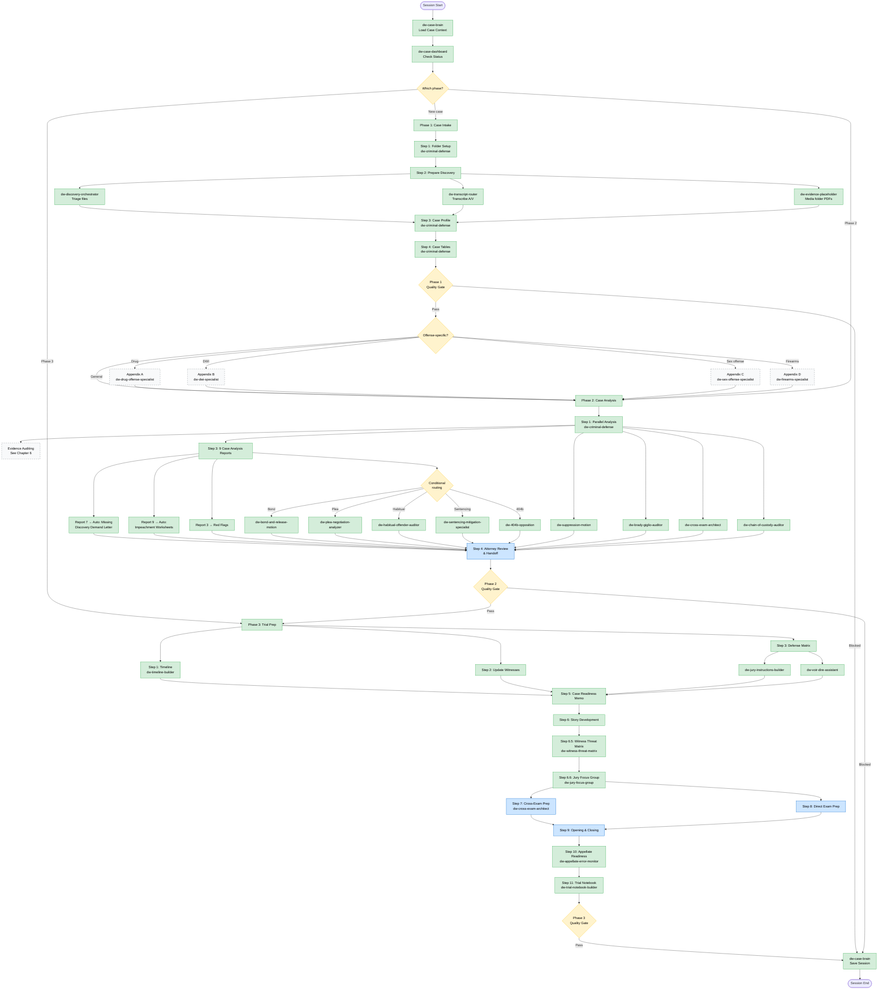

# DW Skill Workflow Guide

A comprehensive guide to the order and structure for running D&W criminal defense skills (`dw-*`) on a case. Use the cheat sheet for quick reference mid-case. Read the full chapters for onboarding or detailed workflow understanding.

---

## Deployment Status

**CRITICAL ALERT:** Several skills referenced in this guide exist only in iCloud and are not yet deployed to the active plugin manifest. Before using them, you must install them from `/Users/greatelephant82/Library/Mobile Documents/com~apple~CloudDocs/Claude Skills/`.

**Must be installed before first use:**
- `dw-shared-protocols` (CRITICAL — required by all drafting skills; no trigger phrase)
- `dw-skill-index`, `dw-data-contracts`
- `dw-timeline-builder`, `dw-exhibit-manager`, `dw-witness-statement-analyzer`
- `dw-billing-narrative-generator`, `dw-client-communication-drafter`
- `dw-case-disposition`, `dw-post-conviction-relief`
- `dw-drug-offense-specialist`, `dw-dwi-specialist`, `dw-firearms-specialist`

All other skills in this guide are deployed and ready to trigger.

---

## Quick-Reference Cheat Sheet

### Phase 0 — Session Management

| Step | Skill | Trigger Phrase | Inputs Needed |
|------|-------|----------------|---------------|
| Load existing case | `dw-case-brain` | "load the case" | Client name or docket number |
| Check case status | `dw-case-dashboard` | "where do we stand" | Loaded case context |
| Find the right skill | `dw-skill-index` | "which skill handles X" | Description of task |

### Phase 1 — Case Intake & Matter Setup

| Step | Skill | Trigger Phrase | Inputs Needed |
|------|-------|----------------|---------------|
| 1. New case / folder setup | `dw-criminal-defense` | "new case" or "case intake" | Confirmed client engagement |
| 2a. Triage incoming discovery | `dw-discovery-orchestrator` | "new discovery arrived" | Raw discovery files |
| 2b. Bate stamp documents | `dw-criminal-defense` | "run Phase 1" | Organized discovery files |
| 2e. Transcribe recordings | `dw-transcript-router` | "transcribe the evidence" | Audio/video files uploaded to casedev vault |
| 2f. Evidence placeholders | `dw-evidence-placeholder` | "evidence placeholders" | Media folders in 05 - Evidence |
| 3. Generate Case Profile & LWOP Worksheet | `dw-criminal-defense` | "run Phase 1" | Organized discovery, court filings |
| 4. Build Case Tables | `dw-criminal-defense` | "run Phase 1" | Evidence folder, Case Profile |

### Phase 2 — Case Processing & Analysis

| Step | Skill | Trigger Phrase | Inputs Needed |
|------|-------|----------------|---------------|
| 1. Parallel analysis | `dw-criminal-defense` | "run Phase 2" | Completed Phase 1 |
| 1a. Constitutional scan | `dw-suppression-motion` | "motion to suppress" | Flagged 4th/5th Amendment issues |
| 1b. Brady/Giglio check | `dw-brady-giglio-auditor` | "run Brady audit" | Evidence Table |
| 1c. Witness cross-ref | `dw-cross-exam-architect` | "build a cross" | Witness inconsistencies |
| 1d. Chain of custody | `dw-chain-of-custody-auditor` | "audit chain of custody" | Physical evidence items |
| 2. Evidence auditing | See Chapter 6 | — | Varies by evidence type |
| 3. 9 Case Analysis Reports | `dw-criminal-defense` | "run Phase 2" | All discovery + parallel analysis |
| 3→7. Auto: demand letter | `dw-brady-giglio-auditor` | (auto-triggered) | Report 7 output |
| 3→9. Auto: impeachment | `dw-cross-exam-architect` | (auto-triggered) | Report 9 output |
| 4. Attorney handoff | `dw-client-communication-drafter` | "update the client" | Phase 2 deliverables |

### Phase 2 — Conditional Routing (if applicable)

| Condition | Skill | Trigger Phrase | Inputs Needed |
|-----------|-------|----------------|---------------|
| Bond concerns | `dw-bond-and-release-motion` | "bond reduction" | Report 3/5 findings |
| Plea interest | `dw-plea-negotiation-analyzer` | "analyze the plea offer" | Offer terms, case strength |
| Habitual exposure | `dw-habitual-offender-auditor` | "audit the habitual bill" | Prior conviction records |
| Sentencing concerns | `dw-sentencing-mitigation-specialist` | "build sentencing mitigation" | Client background |
| 404(b) issues | `dw-404b-opposition` | "oppose the 404(b)" | Prieur notice |
| Offense-specific | See Chapter 7 appendices | — | Varies by offense |

### Phase 3 — Trial Notebook & Attorney Preparation

| Step | Skill | Trigger Phrase | Inputs Needed |
|------|-------|----------------|---------------|
| 1. Case timeline | `dw-timeline-builder` | "build the timeline" | Report 1 |
| 2. Update witness tables | `dw-criminal-defense` | "run Phase 3" | Reports 8, 9 |
| 3. Defense matrix | `dw-criminal-defense` | "run Phase 3" | Charges, defenses |
| 3a. Jury instructions | `dw-jury-instructions-builder` | "jury instructions" | Defense Matrix |
| 3b. Voir dire strategy | `dw-voir-dire-assistant` | "prep voir dire" | Charges, venue data |
| 4. Discovery version control | `dw-discovery-compliance-monitor` | "update the discovery ledger" | Supplemental productions |
| 5. Case readiness memo | `dw-criminal-defense` | "run Phase 3" | All reports + analysis |
| 6. Story development | `dw-criminal-defense` | "run Phase 3" | Reports 4, 6 |
| 6.5 Witness threat matrix | `dw-witness-threat-matrix` | "witness threat matrix" / "rank the witnesses" | Phase 2 reports, witness dossiers |
| 6.6 Jury focus group | `dw-jury-focus-group` | "focus group" / "mock jury" / "jury simulation" | Defense strategy, case facts |
| 7. Cross-exam prep | `dw-cross-exam-architect` | "build a cross for [witness]" | Impeachment worksheets, threat matrix |
| 8. Direct exam prep | `dw-criminal-defense` | "run Phase 3" | Story worksheet |
| 9. Opening/closing prep | `dw-criminal-defense` | "run Phase 3" | Reports 4, 6, Story worksheet |
| 10. Appellate readiness | `dw-appellate-error-monitor` | "preserve error" | Rulings, objections |
| 11. Trial notebook assembly | `dw-trial-notebook-builder` | "build the trial notebook" | All Phase 3 deliverables |

### Any Phase — Administrative

| Task | Skill | Trigger Phrase |
|------|-------|----------------|
| Billing narratives | `dw-billing-narrative-generator` | "log my time" |
| Client letters | `dw-client-communication-drafter` | "client letter" |
| Investigator tasks | `dw-defense-investigator-tasking` | "investigator assignment" |
| Court & jail tracking | `dw-court-jail-tracker` (Mode A: tracker sweep; Mode B: event entry) | "update the tracker" / "jail visit" |
| Compare DMARs | `dw-dmar-synthesizer` | "compare the DMARs" |
| Pretrial motions | `dw-pretrial-motion-library` | "speedy trial" / "motion to compel" / etc. |

---

## Workflow Diagram



**Legend:**
- **Green nodes:** Cowork-automated steps
- **Blue nodes:** Attorney action required
- **Orange diamonds:** Routing decisions / quality gates
- **Gray dashed boxes:** Cross-reference to another chapter

---

## Phase 0 — Session Management

These three skills bookend every working session, regardless of case phase. They are infrastructure — not part of the 3-phase workflow itself, but required for every session.

### dw-case-brain — Memory Layer

The first and last skill invoked in every session.

| | |
|---|---|
| **When** | Start and end of every session |
| **Trigger** | "load the case" / "open the matter" / "pick up where we left off" / "save the session" / "wrap up" |
| **Inputs** | Client name or docket number |
| **Outputs** | **Open:** Loads full case context from Obsidian vault (charges, phase, open issues, session history). **Close:** Writes session delta back to vault. |
| **Key rule** | Always invoked first (loads context) and last (saves progress). Every other skill operates within the context it provides. |

### dw-case-dashboard — Status Layer

Orients you on where the case stands before starting work.

| | |
|---|---|
| **When** | Before starting work on a case, to check current state |
| **Trigger** | "where do we stand" / "case status" / "what's pending" |
| **Inputs** | Loaded case context (from case-brain) |
| **Outputs** | Current phase, open issues count, pending attorney actions, upcoming deadlines, quality gate status |

### dw-skill-index — Routing Layer

Finds the right skill when you're unsure what to invoke.

| | |
|---|---|
| **When** | Unsure which skill handles a specific task |
| **Trigger** | "which skill handles X" / "what skills do we have" / "help me find the right tool" |
| **Inputs** | Natural language description of what you need to do |
| **Outputs** | Recommended skill name with trigger phrase and category |

### How they relate

```
Session Open → case-brain loads context
             → case-dashboard shows status
             → [work happens using phase-specific skills]
             → case-brain saves session delta
Session End
```

- **case-brain** is the memory — it knows what happened across sessions
- **case-dashboard** is the status — it knows where you are right now
- **skill-index** is the router — it knows which skill does what

---

## Phase 1 — Case Intake & Matter Setup

*Triggered when a new client engagement is confirmed. Covers everything from folder creation through a fully organized, Bate-stamped, searchable case file with a complete Case Profile.*

**Master skill:** `dw-criminal-defense` — invoke with "new case" or "case intake" to start Phase 1.

### Step 1: Folder Setup

| | |
|---|---|
| **Skill** | `dw-criminal-defense` (Phase 1 trigger) |
| **Inputs** | Confirmed client engagement |
| **Outputs** | Standard folder structure verified (`01 - Trial Notebook` with all sub-tabs, `02 - Pretrial Notebook` with all sub-tabs), `Case Tables.xlsx` located at case root |
| **No specialist skills** | This is structural setup only |

### Step 2: Prepare Discovery for Review

The most skill-dense step in Phase 1. Converts raw discovery into organized, Bate-stamped, searchable files.

**2a — Download & Organize Discovery**

| | |
|---|---|
| **Skill** | `dw-discovery-orchestrator` |
| **Trigger** | "new discovery arrived" / "triage discovery" |
| **Inputs** | Raw discovery files from prosecution |
| **Outputs** | Discovery Triage Report with routing recommendations, files sorted into Pleadings and Discovery subfolders, Download Log generated |

**2b — Bate Stamp Documents**

| | |
|---|---|
| **Skill** | `dw-criminal-defense` (within Phase 1) |
| **Inputs** | Organized discovery files |
| **Outputs** | Sequentially numbered documents, updated Bate Stamp Master Log |
| **Key rule** | Check log for current highest number before stamping. Never restart numbering mid-case. |

**2e — Transcribe Interviews & Digital Media**

| | |
|---|---|
| **Skill** | `dw-transcript-router` |
| **Trigger** | "transcribe the evidence" / "process the recordings" |
| **Inputs** | Audio/video files uploaded to casedev vault |
| **Outputs** | Transcript PDFs named identically to source A/V files |
| **Routing** | Calcasieu Parish → `dw-transcript-pipeline-calcasieu` (JusticeText). All other parishes → `dw-transcript-pipeline-rev` (Rev.com). |

**2f — Digital Evidence Placeholders**

| | |
|---|---|
| **Skill** | `dw-evidence-placeholder` |
| **Trigger** | "evidence placeholders" / "catalog the media folders" |
| **Inputs** | Media folders (photos, videos, audio, body cam) in `05 - Evidence` |
| **Outputs** | One-page placeholder PDF per media folder with file count, type breakdown, and storage path |

### Step 3: Generate Case Profile & LWOP Worksheet

| | |
|---|---|
| **Skill** | `dw-criminal-defense` (continues Phase 1) |
| **Inputs** | All organized discovery, court filings, Clio intake data |
| **Outputs** | `000 - Case Profile.docx` saved to `Pretrial Notebook → 03 - Case Analysis & Notes`. If applicable (homicide or sex offense with LWOP exposure): LWOP review worksheet auto-populated |
| **Contains** | Case identification, charges & exposure with La. R.S. citations, arraignment & bail, case-specific defenses grounded in actual evidence, client background (attorney completes), key dates & next steps. **LWOP worksheet:** Eligibility analysis, mitigation factors, statutory requirements (homicide: Art. 30.1; sex offense: La. R.S. 15:567.1) |
| **Note** | The LWOP functionality previously in `dw-lwop-populator` (deprecated) is now integrated into Phase 1 Step 3. Trigger phrases "LWOP sheet," "LWOP review," "District Defender review," and "life without parole worksheet" all route to `dw-criminal-defense` Phase 1. |

### Step 4: Build Case Tables

| | |
|---|---|
| **Skill** | `dw-criminal-defense` (continues Phase 1) |
| **Inputs** | Completed evidence folder, Case Profile |
| **Outputs** | Three sheets populated in `Case Tables.xlsx` (never create new sheets): |

| Sheet | Contents | Key Columns |
|-------|----------|-------------|
| Evidence Table | Full discovery catalog | Doc #, Evidence Type, Name, Description, Bate Stamp, Reviewed, Notes, Discovery Set, Date, **Review Priority** (AI), **Defense Relevance** (AI) |
| Witness List - Priority | Ranked by witness impact | Name, Witness Type, Association, Sources (Bate stamps), Trial Exam Prepared |
| Witness List - Alpha | Same data, alphabetical | Same columns as Priority |

### Phase 1 Quality Gate

Before advancing to Phase 2, confirm:

- [ ] Folder structure confirmed — all standard subfolders exist
- [ ] Discovery fully organized, Bate-stamped, OCR'd, transcribed
- [ ] Digital evidence placeholder exists for every media folder
- [ ] `000 - Case Profile.docx` complete with all auto-populated fields
- [ ] Evidence Table: all 11 columns populated, row count matches file count
- [ ] Witness Tables (Priority and Alpha) populated

### Supplemental Discovery (Any Time)

When new discovery arrives after Phase 1 is complete:
- `dw-discovery-orchestrator` — triage and route new files
- `dw-discovery-compliance-monitor` — track State's compliance with disclosure obligations
- Re-run Bate stamping and Evidence Table updates as needed

---

## Phase 2 — Case Processing & Analysis

*Runs parallel analysis before attorney review. Auto-actions from Reports 7 and 9 eliminate rework in Phase 3.*

**Master skill:** `dw-criminal-defense` — invoke with "run Phase 2" after Phase 1 Quality Gate passes.

### Step 1: Parallel Analysis

Cowork independently analyzes all case documents and routes findings to specialists.

| Finding | Routed To | Trigger |
|---------|-----------|---------|
| Constitutional issues (4th/5th/6th Amendment) | `dw-suppression-motion` | "motion to suppress" |
| Undisclosed favorable material | `dw-brady-giglio-auditor` | "run Brady audit" |
| Witness inconsistencies across documents | `dw-cross-exam-architect` | "build a cross" |
| Custody chain gaps for physical evidence | `dw-chain-of-custody-auditor` | "audit chain of custody" |

**Inputs:** Completed Phase 1 — all evidence organized, Case Profile, Case Tables populated.
**Outputs:** Parallel analysis reports saved to `01 - Trial Notebook/09 - Case Analysis/Cowork Analysis/`

### Step 2: Evidence-Type Routing

Identify what evidence types exist in the case and route to the appropriate auditing skills. **See Chapter 6 for the full Evidence Auditing Reference.**

| If the case contains... | Route to | Chapter 6 Section |
|-------------------------|----------|-------------------|
| Cell phone extraction | `dw-mobile-forensic-auditor` → then `dw-forensic-dump-analyzer` | Digital Device Evidence |
| Body cam / dash cam / CCTV | `dw-video-evidence-auditor` | Video & Surveillance |
| Cell tower / GPS data | `dw-cell-site-geolocation-auditor` | Location & Communications |
| Social media evidence | `dw-social-media-auditor` | Location & Communications |
| Crime scene processing | `dw-crime-scene-auditor` | Physical Evidence & Scene |
| Photo array / lineup | `dw-eyewitness-identification-auditor` | Witness & Interview |
| Adult interrogation / confession | `dw-confession-interrogation-auditor` | Witness & Interview |
| Child forensic interview | `dw-child-forensic-interview-auditor` | Witness & Interview |
| Prosecution expert witness | `dw-expert-witness-evaluator` | Expert Witnesses |
| Deleted phone data / SQLite | `dw-sqlite-recovery` | Digital Device Evidence |

**Key sequencing:** Run `dw-mobile-forensic-auditor` (HOW extraction was done) before `dw-forensic-dump-analyzer` (WHAT's on the phone).

### Step 3: The 9 Case Analysis Reports

| # | Report | Priority | Skill Routing |
|---|--------|----------|---------------|
| 1 | Comprehensive Case Timeline | Standard | — |
| 2 | Prosecution's Case Summary | Standard | — |
| 3 | Immediate Red Flags | **HIGH** | `dw-suppression-motion` (warrant/search), `dw-expert-witness-evaluator` (expert issues) |
| 4 | Core Defense Narrative | Standard | — |
| 5 | Viable Legal Defenses | Standard | `dw-404b-opposition` (bad acts), `dw-sentencing-mitigation-specialist` (exposure), `dw-habitual-offender-auditor` (habitual claims) |
| 6 | Memorable Theme | Standard | — |
| 7 | Table of Missing Discovery | **HIGH → Auto-Action** | `dw-brady-giglio-auditor` |
| 8 | Witness Table | Standard | — |
| 9 | Key Witness Impeachment Plan | **HIGH → Auto-Action** | `dw-cross-exam-architect` |

**Auto-Action — Report 7:** Immediately generates a Missing Discovery Demand Letter citing Brady/Giglio obligations with La. statutory citations. Attorney must approve before sending.

**Auto-Action — Report 9:** Creates one Impeachment Worksheet per key witness with all prior statements, Bate stamp references, and impeachment material pre-populated.

### Conditional Routing from Reports 3 and 5

| If reports identify... | Route to | Trigger |
|------------------------|----------|---------|
| Bond concerns | `dw-bond-and-release-motion` | "bond reduction" |
| Prosecution plea interest | `dw-plea-negotiation-analyzer` | "analyze the plea offer" |
| Habitual offender exposure | `dw-habitual-offender-auditor` | "audit the habitual bill" |
| Sentencing concerns | `dw-sentencing-mitigation-specialist` | "build sentencing mitigation" |
| 404(b) / other crimes evidence | `dw-404b-opposition` | "oppose the 404(b)" |

### Step 4: Attorney Review & Handoff

| Task | Skill | Trigger |
|------|-------|---------|
| Draft attorney notification email | `dw-client-communication-drafter` | "update the client" |
| Generate billing narratives | `dw-billing-narrative-generator` | "log my time" |
| Push Attorney Review Checklist | `dw-criminal-defense` (auto) | Pushed to Google Docs + Apple Notes |

### Phase 2 Quality Gate

Before advancing to Phase 3, confirm:

- [ ] All 9 reports named correctly and saved to correct locations
- [ ] Cowork Parallel Analysis complete — outputs in Cowork Analysis subfolder
- [ ] Missing Discovery Demand Letter drafted — Clio task assigned to attorney
- [ ] Impeachment Worksheet exists for every witness in Report 9
- [ ] Witness Dossier cover page exists for every key witness
- [ ] Attorney notified via email AND Clio task
- [ ] Attorney Review Checklist pushed to Google Docs (or fallback .md at case root)
- [ ] Attorney Review Checklist pushed to Apple Notes (or fallback .md at case root)

---

## Phase 3 — Trial Notebook & Attorney Preparation

*Converts case analysis into actionable trial preparation. Cowork pre-builds all templates; attorneys complete cross and direct exam preparation.*

**Master skill:** `dw-criminal-defense` — invoke with "run Phase 3" after Phase 2 Quality Gate passes.

### Step 1: Case Timeline Spreadsheet

| | |
|---|---|
| **Skills** | `dw-criminal-defense` (Phase 3 trigger), `dw-timeline-builder` for complex timelines |
| **Trigger** | "build the timeline" / "case timeline" / "visual timeline" |
| **Inputs** | Report 1 (Comprehensive Case Timeline) from Phase 2 |
| **Outputs** | Timeline Sheet in `Case Tables.xlsx` — chronological, color-coded (red = prosecution, green = defense-favorable, white = neutral), with Bate stamp references and conflict flags |

### Step 2: Update Witness Tables

| | |
|---|---|
| **Skill** | `dw-criminal-defense` (continues Phase 3) |
| **Inputs** | Reports 8 (Witness Table) and 9 (Impeachment Plan), Phase 1 witness tables |
| **Outputs** | Updated Priority and Alpha tables — new witnesses merged, impeachment witnesses bold-marked as **KEY WITNESS**, re-ranked |

### Step 3: Defense Matrix

| | |
|---|---|
| **Skill** | `dw-criminal-defense` (continues Phase 3) |
| **Inputs** | Charges, responsive verdicts (from Art 814), identified defenses |
| **Outputs** | Defense Matrix sheet in `Case Tables.xlsx` — all 6 columns populated |
| **Routes to** | `dw-jury-instructions-builder` for instruction drafting, `dw-voir-dire-assistant` for juror challenge strategy |

**dw-jury-instructions-builder**

| | |
|---|---|
| **Trigger** | "jury instructions" / "jury charges" / "verdict form" |
| **Inputs** | Defense Matrix, charges with La. C.Cr.P. Art. 801-807 |
| **Outputs** | Proposed jury charges, verdict forms, lesser included offense analysis, responsive verdict instructions |

**dw-voir-dire-assistant**

| | |
|---|---|
| **Trigger** | "prep voir dire" / "jury selection" / "Batson challenge" |
| **Inputs** | Charges, venue data, defense themes |
| **Outputs** | Juror analysis cards, risk ratings, strike tracking, Batson compliance documentation |

### Step 4: Version Control

| | |
|---|---|
| **Skill** | `dw-discovery-compliance-monitor` |
| **Trigger** | "update the discovery ledger" |
| **Inputs** | Amended or supplemental productions from prosecution |
| **Outputs** | Version control log, superseded documents marked (not deleted) in Evidence Table |

### Step 5: Case Readiness Memo

| | |
|---|---|
| **Skill** | `dw-criminal-defense` (continues Phase 3) |
| **Inputs** | All 9 reports, Cowork parallel analysis, current case status |
| **Outputs** | One-page memo — the attorney's single entry point into the Trial Notebook |

### Step 6: Story Development

| | |
|---|---|
| **Skill** | `dw-criminal-defense` (continues Phase 3) |
| **Inputs** | Report 4 (Core Defense Narrative), Report 6 (Memorable Theme) |
| **Outputs** | Discover the Story Worksheet — foundation for all witness examination and trial presentation |

### Step 6.5: Witness Threat Matrix

*Analytical capstone for Phase 3 — synthesizes Phase 2 parallel analysis into ranked witness lists with damage and vulnerability scores.*

| | |
|---|---|
| **Skill** | `dw-witness-threat-matrix` |
| **Trigger** | "witness threat matrix" / "rank the witnesses" / "key witnesses" / "post-cross refresh" |
| **Inputs** | Phase 2 Reports 8 & 9 (Witness Table and Impeachment Plan), witness dossiers, Brady/Giglio findings |
| **Outputs** | Top 5 ranked lists by witness type with separate Damage Score (prosecution strength) and Vulnerability Score (defense attack surface) for each witness. Post-Cross Refresh mode available for re-scoring after cross-examinations are completed. |
| **Routes to** | Feeds directly into `dw-cross-exam-architect` for Step 7 |

### Step 6.6: Jury Focus Group

*Strategy-testing layer distinct from voir dire — predicts juror reactions using demographically accurate Louisiana parish mock panels.*

| | |
|---|---|
| **Skill** | `dw-jury-focus-group` |
| **Trigger** | "focus group" / "mock jury" / "jury simulation" / "test my defense" |
| **Inputs** | Defense strategy, case facts, key themes |
| **Outputs** | Mock juror demographic profiles (Louisiana parish accurate), predicted reaction matrix, juror comment synthesis, strategy refinement recommendations |
| **Distinct from** | `dw-voir-dire-assistant` (real voir dire juror challenge strategy) and `dw-jury-instructions-builder` (jury charges/verdict forms) |

### Step 7: Cross-Exam Preparation (Per Key Witness)

*Attorney work — Cowork prepopulates templates with available intelligence.*

| | |
|---|---|
| **Primary skill** | `dw-cross-exam-architect` |
| **Trigger** | "build a cross for [witness]" / "cross-exam outline" |
| **Inputs** | Impeachment Worksheets (Phase 2), witness dossiers, all prior statements with Bate stamps |
| **Outputs** | Cross-Examination Outline (.docx), Source/Exhibit Document Catalog (.pdf), Combined Source Documents (.pdf) |

**Specialist routing by witness type:**

| Witness Type | Additional Skill | Trigger |
|-------------|-----------------|---------|
| Eyewitness to crime | `dw-eyewitness-identification-auditor` | "audit the lineup" |
| Prosecution expert | `dw-expert-witness-evaluator` | "evaluate the expert" |
| Interrogating officer (confession case) | `dw-confession-interrogation-auditor` | "audit interrogation" |
| Witness with prior statements | `dw-witness-statement-analyzer` | "analyze this statement" |

### Step 8: Direct Exam Preparation (Per Defense Witness)

| | |
|---|---|
| **Skill** | `dw-criminal-defense` (continues Phase 3) |
| **Inputs** | Discover the Story Worksheet, witness dossiers |
| **Outputs** | Mapping the Direct Worksheets, Direct Exam Templates — saved to `Trial Notebook → 03 - Witnesses/Defense Witnesses/` |

### Step 9: Opening Statement & Closing Argument Preparation

| | |
|---|---|
| **Skill** | `dw-criminal-defense` (continues Phase 3) |
| **Inputs** | Report 4 (Core Defense Narrative), Report 6 (Memorable Theme), Discover the Story Worksheet |
| **Outputs** | Mapping the Story templates (Opening and Closing) — framework populated, attorney completes |

### Step 10: Appellate Readiness

| | |
|---|---|
| **Skill** | `dw-appellate-error-monitor` |
| **Trigger** | "preserve error" / "log error" / "appellate error" |
| **Inputs** | Evidentiary rulings, objections made, constitutional issues raised |
| **Outputs** | Running error preservation log — maintained throughout Phase 3 AND during trial |
| **Key rule** | This is not a one-time step. Invoke throughout Phase 3 and during trial whenever an error needs preserving. |

### Step 11: Trial Notebook Assembly

| | |
|---|---|
| **Skill** | `dw-trial-notebook-builder` |
| **Trigger** | "build the trial notebook" / "ready for trial" |
| **Inputs** | All Phase 3 deliverables — timeline, witness tables, defense matrix, jury instructions, cross/direct exam templates, opening/closing frameworks, error log |
| **Outputs** | Assembled trial notebook with master index, all tabs populated, Trial Readiness Gap Report flagging any missing components |

### Phase 3 Quality Gate

Before trial, confirm:

- [ ] Timeline Sheet populated and color-coded
- [ ] Witness Tables updated with Phase 2 intelligence
- [ ] Defense Matrix complete — all charges, responsive verdicts, and defenses
- [ ] Jury instructions drafted and filed
- [ ] Voir dire strategy prepared
- [ ] Witness Threat Matrix completed with damage/vulnerability scores
- [ ] Jury Focus Group testing completed — strategy refined
- [ ] Cross-Exam materials complete for all Key Witnesses (threat-ranked) and Top 10 Priority
- [ ] Direct Exam templates complete for all defense witnesses
- [ ] Opening/Closing frameworks populated
- [ ] Appellate error log active
- [ ] Trial Notebook assembled — Gap Report shows no critical missing items

**Available throughout Phase 3:**
- `dw-billing-narrative-generator` — "log my time"
- `dw-client-communication-drafter` — "client letter" / "jail mail"

---

## Phase 4 — Trial Execution

*In-trial and real-time support. Light section — flagged as future expansion area.*

### Overview

Phase 4 begins on trial day and concludes with verdict entry (acquittal, conviction, mistrial, or diversion agreement).

### Skills

| Skill | Purpose | Trigger |
|-------|---------|---------|
| `dw-appellate-error-monitor` (active mode) | Maintain running error log during trial; flag preservation opportunities | "log error" / "preserve this" (any evidentiary ruling or objection) |
| `dw-exhibit-manager` | Trial exhibit lifecycle — pre-marking, admission tracking, exhibit lists. **iCloud-only, not deployed.** | "mark exhibits" / "exhibit list" / "admitted" |

### Running the Phase

1. **Before opening statement:** Verify trial notebook indexed and all exhibits listed in exhibit-manager.
2. **Throughout trial:** Log errors in real-time as they occur (appellate-error-monitor).
3. **Upon verdict:** Transition to Phase 5.

### Future Expansion

Phase 4 is intentionally minimal. Planned: jury communication skill, courtroom logistics automation, real-time transcript integration. Currently manual attorney work.

---

## Phase 5 — Post-Trial / Disposition

*After verdict, plea entry, or dismissal. Covers case closing, sentencing, appeals, and PCR eligibility.*

### Overview

Phase 5 begins when the trial phase (or Phase 2 plea/dismissal) concludes and extends through final disposition (sentencing, appeal decision, or closure).

### Skills by Outcome

#### Trial Verdict (Conviction or Acquittal)

| Skill | Purpose | Trigger |
|-------|---------|---------|
| `dw-case-disposition` | Comprehensive closing — outcome record, final billing, appeal/expungement eligibility | "close the case" / "disposition" / "verdict entered" |
| `dw-sentencing-mitigation-specialist` (if convicted) | Mitigation package, PSI audit, sentencing memorandum | "sentencing" / "mitigation" / "PSI audit" |
| `dw-habitual-offender-auditor` (if applicable) | Challenge habitual bill before sentencing | "habitual bill" / "predicate conviction" |
| `dw-appellate-error-monitor` (post-trial assessment mode) | Finalize error log, identify preserved issues for appeal | "appeal analysis" / "appellate issues" |
| `dw-post-conviction-relief` | Evaluate PCR, habeas corpus, sentence modification eligibility | "post-conviction" / "PCR" / "ineffective assistance" |

#### Plea Agreement (Any Phase)

| Skill | Purpose | Trigger |
|-------|---------|---------|
| `dw-plea-negotiation-analyzer` | Evaluate plea offer against trial exposure | "plea offer" / "analyze the plea" |
| `dw-case-disposition` | Document plea terms, final billing, Boykin checklist | "plea entered" / "disposition" |
| `dw-sentencing-mitigation-specialist` (if applicable) | Mitigation before sentencing under agreed terms | "sentencing" / "mitigation" |
| `dw-post-conviction-relief` | Assess collateral consequences, PCR eligibility | "sentence modification" / "post-conviction" |

#### Dismissal (Any Phase)

| Skill | Purpose | Trigger |
|-------|---------|---------|
| `dw-case-disposition` | Final billing, client notification, expungement eligibility | "case dismissed" / "disposition" |

### Phase 5 Quality Gate

Before closing the case, confirm:

- [ ] Disposition record completed (verdict/plea/dismissal + date)
- [ ] Final billing narratives logged and billed
- [ ] Client notified of outcome and next steps
- [ ] Appeal timeline and options clearly documented
- [ ] Expungement eligibility assessed and filed (if applicable)
- [ ] All trial error preserved in appellate-error-monitor (if conviction)
- [ ] Post-conviction relief eligibility evaluated (if sentence > 2 years)
- [ ] Case marked closed in case-brain

---

## Chapter 6: Evidence Auditing Reference

Thirteen evidence auditing skills organized by evidence category. Each entry covers: when to use, trigger phrases, inputs needed, outputs produced, and sequencing dependencies.

**When to use this chapter:** During Phase 2 Step 2 (Evidence-Type Routing), identify which evidence types exist in your case and invoke the corresponding auditing skills.

### Evidence Decision Tree

```mermaid
flowchart TD
    classDef skill fill:#d4edda,stroke:#28a745,color:#000
    classDef question fill:#fff3cd,stroke:#ffc107,color:#000

    START([What evidence<br/>do you have?])

    PHONE{Cell phone<br/>extraction?}:::question
    START --> PHONE
    PHONE -->|Yes| MOBILE[dw-mobile-forensic-auditor<br/>Audit extraction method]:::skill
    MOBILE --> DUMP[dw-forensic-dump-analyzer<br/>Analyze phone contents]:::skill
    DUMP --> DELETED{Deleted data<br/>suspected?}:::question
    DELETED -->|Yes| SQLITE[dw-sqlite-recovery<br/>Recover deleted records]:::skill

    PHONE -->|No| VIDEO{Body cam /<br/>dash cam / CCTV?}:::question
    DELETED -->|No| VIDEO
    SQLITE --> VIDEO

    VIDEO -->|Yes| VID_AUDIT[dw-video-evidence-auditor<br/>Audit video evidence]:::skill
    VIDEO -->|No| CELL{Cell tower /<br/>GPS data?}:::question
    VID_AUDIT --> CELL

    CELL -->|Yes| CELL_AUDIT[dw-cell-site-geolocation-auditor<br/>Audit location data]:::skill
    CELL -->|No| SOCIAL{Social media<br/>evidence?}:::question
    CELL_AUDIT --> SOCIAL

    SOCIAL -->|Yes| SOCIAL_AUDIT[dw-social-media-auditor<br/>Audit social media]:::skill
    SOCIAL -->|No| SCENE{Crime scene<br/>processing?}:::question
    SOCIAL_AUDIT --> SCENE

    SCENE -->|Yes| SCENE_AUDIT[dw-crime-scene-auditor<br/>Audit scene processing]:::skill
    SCENE -->|No| CUSTODY{Physical evidence<br/>chain issues?}:::question
    SCENE_AUDIT --> CUSTODY

    CUSTODY -->|Yes| CUSTODY_AUDIT[dw-chain-of-custody-auditor<br/>Verify custody chain]:::skill
    CUSTODY -->|No| EYEWITNESS{Eyewitness ID /<br/>lineup?}:::question
    CUSTODY_AUDIT --> EYEWITNESS

    EYEWITNESS -->|Yes| EYE_AUDIT[dw-eyewitness-identification-auditor<br/>Audit ID procedures]:::skill
    EYEWITNESS -->|No| CONFESS{Interrogation /<br/>confession?}:::question
    EYE_AUDIT --> CONFESS

    CONFESS -->|Yes| CONFESS_AUDIT[dw-confession-interrogation-auditor<br/>Audit interrogation]:::skill
    CONFESS -->|No| CHILD{Child forensic<br/>interview?}:::question
    CONFESS_AUDIT --> CHILD

    CHILD -->|Yes| CHILD_AUDIT[dw-child-forensic-interview-auditor<br/>Audit CAC interview]:::skill
    CHILD -->|No| EXPERT{Prosecution<br/>expert witness?}:::question
    CHILD_AUDIT --> EXPERT

    EXPERT -->|Yes| EXPERT_AUDIT[dw-expert-witness-evaluator<br/>Evaluate expert]:::skill
    EXPERT -->|No| DONE([Evidence<br/>auditing complete])
    EXPERT_AUDIT --> DONE
```



---

### Digital Device Evidence

#### dw-mobile-forensic-auditor

| | |
|---|---|
| **Purpose** | Audit HOW a phone extraction was performed — Cellebrite methodology, consent/warrant basis, extraction type, tool version |
| **Trigger** | "audit the Cellebrite" / "audit the phone extraction" |
| **Inputs** | Cellebrite extraction report, consent/warrant documentation |
| **Outputs** | Extraction methodology audit, constitutional challenge points, tool reliability assessment |
| **Depends on** | None — **run this first** before analyzing phone contents |

#### dw-forensic-dump-analyzer

| | |
|---|---|
| **Purpose** | Analyze WHAT's on the phone — messages, calls, app data, photos, location history, deleted content |
| **Trigger** | "analyze the phone dump" |
| **Inputs** | Phone extraction data (Cellebrite report, raw dump files) |
| **Outputs** | Content analysis with defense-relevant findings, communication timeline, app-specific data extraction |
| **Depends on** | `dw-mobile-forensic-auditor` must complete first (extraction methodology informs content reliability) |

#### dw-sqlite-recovery

| | |
|---|---|
| **Purpose** | Recover deleted messages, app databases, and artifacts from SQLite database files |
| **Trigger** | "recover deleted messages" |
| **Inputs** | SQLite database files from phone extraction |
| **Outputs** | Recovered records with metadata, deletion timeline, data integrity assessment |
| **Depends on** | Can run alongside `dw-forensic-dump-analyzer` |

---

### Video & Surveillance

#### dw-video-evidence-auditor

| | |
|---|---|
| **Purpose** | Audit body cam, dash cam, and CCTV footage — gaps, timestamp integrity, chain of custody, key moments |
| **Trigger** | "audit body cam" / "audit dash cam" / "audit the video" |
| **Inputs** | Video files, activation logs, metadata |
| **Outputs** | Gap analysis, timestamp verification, key moment annotations, authentication assessment |
| **Depends on** | None |

---

### Location & Communications

#### dw-cell-site-geolocation-auditor

| | |
|---|---|
| **Purpose** | Audit cell tower records, GPS data, and location tracking methodology — challenge precision claims |
| **Trigger** | "audit cell site" / "cell tower records" |
| **Inputs** | CSLI records, call detail records, carrier documentation |
| **Outputs** | Coverage analysis, precision limitations, methodology challenges |
| **Depends on** | None |

#### dw-social-media-auditor

| | |
|---|---|
| **Purpose** | Audit social media screenshots, DMs, account authenticity — challenge authentication and completeness |
| **Trigger** | "audit Facebook" / "social media" |
| **Inputs** | Social media screenshots, account records, platform preservation requests |
| **Outputs** | Authentication audit, completeness assessment, metadata analysis, fabrication indicators |
| **Depends on** | None |

---

### Physical Evidence & Scene

#### dw-crime-scene-auditor

| | |
|---|---|
| **Purpose** | Audit crime scene processing — collection methods, contamination risks, protocol compliance |
| **Trigger** | "audit crime scene" |
| **Inputs** | Crime scene reports, photos, evidence collection logs, officer reports |
| **Outputs** | Protocol compliance audit, contamination risk assessment, collection deficiency report |
| **Depends on** | None |

#### dw-chain-of-custody-auditor

| | |
|---|---|
| **Purpose** | Verify unbroken custody chain for every piece of physical evidence |
| **Trigger** | "audit chain of custody" |
| **Inputs** | Evidence custody logs, property room records, lab intake records |
| **Outputs** | Custody gap report, handling deficiency flags, suppression argument assessment |
| **Depends on** | None |

---

### Witness & Interview

#### dw-eyewitness-identification-auditor

| | |
|---|---|
| **Purpose** | Audit photo arrays, lineups, and show-ups for suggestiveness — challenge identification reliability |
| **Trigger** | "audit the lineup" / "photo array" |
| **Inputs** | Photo array documentation, lineup procedures, witness statements, officer instructions |
| **Outputs** | Suggestiveness audit against Manson/Biggers factors, procedural deficiency report, suppression viability |
| **Depends on** | None |

#### dw-confession-interrogation-auditor

| | |
|---|---|
| **Purpose** | Audit adult interrogation tactics, Miranda compliance, voluntariness — identify coercion indicators |
| **Trigger** | "audit interrogation" / "audit the confession" |
| **Inputs** | Interrogation recording/transcript, Miranda documentation, booking records |
| **Outputs** | Tactic identification (Reid technique, minimization, maximization), Miranda compliance audit, voluntariness assessment, suppression argument |
| **Depends on** | None |

#### dw-child-forensic-interview-auditor

| | |
|---|---|
| **Purpose** | Audit Children's Advocacy Center forensic interviews against NICHD and CornerHouse protocols |
| **Trigger** | "audit the CAC video" / "audit the forensic interview" |
| **Inputs** | CAC interview recording/transcript |
| **Outputs** | Protocol compliance audit, suggestive questioning identification, developmental appropriateness assessment |
| **Depends on** | None |

---

### Expert Witnesses

#### dw-expert-witness-evaluator

| | |
|---|---|
| **Purpose** | Evaluate prosecution expert qualifications, methodology, and testimony — identify Daubert/Foret challenge grounds |
| **Trigger** | "evaluate the expert" |
| **Inputs** | Expert CV, prior testimony, methodology documentation, relevant scientific literature |
| **Outputs** | Qualification challenge points, methodology critique, Daubert/Foret analysis, cross-examination material |
| **Depends on** | None |

---

### Discovery Tracking

#### dw-brady-giglio-auditor

| | |
|---|---|
| **Purpose** | Identify material favorable to the defense that the prosecution may not have disclosed |
| **Trigger** | "run Brady audit" |
| **Inputs** | Evidence Table (must be populated), all discovery documents |
| **Outputs** | Brady/Giglio checklist, undisclosed material flags, demand letter content |
| **Depends on** | Requires completed Evidence Table from Phase 1 |

#### dw-discovery-compliance-monitor

| | |
|---|---|
| **Purpose** | Track the State's compliance with discovery disclosure obligations across all productions |
| **Trigger** | "update the discovery ledger" |
| **Inputs** | Evidence Table, production logs, court orders |
| **Outputs** | Compliance ledger, outstanding items, motion to compel recommendations |
| **Depends on** | Requires completed Evidence Table from Phase 1 |

---

## Chapter 7: Offense-Specific Appendices

These appendices add offense-specific skills and considerations on top of the core 3-phase workflow. They do not replace the core workflow — they augment it. Invoke the specialist skill during Phase 2 Step 1 (Parallel Analysis) and Phase 3 Step 3 (Defense Matrix).

---

### Appendix A: Drug Offenses

**Applies to:** La. R.S. 40:966-970 — possession, distribution, trafficking, CDS scheduling

| | |
|---|---|
| **Specialist skill** | `dw-drug-offense-specialist` |
| **Trigger** | "drug charge" / "possession" / "distribution" / "trafficking" / "CDS" |
| **Invoke during** | Phase 2 Step 1 (parallel analysis), Phase 3 Step 3 (Defense Matrix) |
| **Inputs** | Charges with statutory citations, lab reports, field test results, weight documentation, officer reports |
| **Outputs** | Defense framework covering constructive possession challenges, weight analysis, field test reliability, scheduling accuracy, 893 diversion eligibility, drug court assessment |

**Commonly paired with:**

| Skill | Why |
|-------|-----|
| `dw-suppression-motion` | Search/seizure issues are central to most drug cases |
| `dw-chain-of-custody-auditor` | Lab handling and evidence integrity challenges |
| `dw-mobile-forensic-auditor` | Phone evidence often used to prove distribution intent |

---

### Appendix B: DWI

**Applies to:** La. R.S. 14:98 — DWI/DUI, operating while intoxicated

| | |
|---|---|
| **Specialist skill** | `dw-dwi-specialist` |
| **Trigger** | "DWI" / "DUI" / "drunk driving" / "Intoxilyzer" / "field sobriety" |
| **Invoke during** | Phase 2 Step 1 (parallel analysis), Phase 3 Step 3 (Defense Matrix) |
| **Inputs** | Breath/blood test results, SFST documentation, dash cam/body cam footage, officer training records |
| **Outputs** | Defense framework covering breath/blood test challenges, SFST protocol audit, rising BAC defense, retrograde extrapolation analysis, enhancement ladder assessment |

**Commonly paired with:**

| Skill | Why |
|-------|-----|
| `dw-video-evidence-auditor` | Dash cam and body cam critical for challenging officer observations and SFST performance |
| `dw-suppression-motion` | Traffic stop legality, probable cause for arrest |
| `dw-expert-witness-evaluator` | Challenge toxicology or breath test expert methodology |

---

### Appendix C: Sex Offenses

**Applies to:** La. R.S. 14:42-43.5 — sexual assault, sexual battery, indecent behavior, child molestation

| | |
|---|---|
| **Specialist skill** | `dw-sex-offense-specialist` |
| **Trigger** | "sex offense" / "rape shield" / "SANE exam" / "sexual assault" |
| **Invoke during** | Phase 2 Step 1 (parallel analysis), Phase 3 Steps 3 and 7 (Defense Matrix and Cross-Exam) |
| **Inputs** | SANE examination report, forensic interview recordings, DNA/lab reports, disclosure timeline, Art. 412 (rape shield) notices |
| **Outputs** | Defense framework covering SANE audit, rape shield strategy, forensic interview issues, delayed disclosure analysis, DNA mixture interpretation, SORNA implications |

**Commonly paired with:**

| Skill | Why |
|-------|-----|
| `dw-child-forensic-interview-auditor` | If minor victim — audit CAC interview for protocol compliance |
| `dw-expert-witness-evaluator` | Challenge SANE nurse methodology, DNA analyst, child psychology expert |
| `dw-404b-opposition` | Prosecution frequently seeks prior bad acts in sex cases |
| `dw-social-media-auditor` | Social media often central to these cases |

---

### Appendix D: Firearms Offenses

**Applies to:** La. R.S. 14:95, R.S. 14:95.1, 18 U.S.C. § 922(g) — illegal carrying, felon-in-possession (state and federal)

| | |
|---|---|
| **Specialist skill** | `dw-firearms-specialist` |
| **Trigger** | "gun charge" / "firearm" / "felon in possession" / "illegal carrying" |
| **Invoke during** | Phase 2 Step 1 (parallel analysis), Phase 3 Step 3 (Defense Matrix) |
| **Inputs** | Weapon seizure documentation, ballistics reports, prior conviction records (for felon-in-possession), concealed carry permits if applicable |
| **Outputs** | Defense framework covering state/federal jurisdiction analysis, Second Amendment challenges (post-Bruen), constructive vs. actual possession, firearm enhancement exposure, prohibited person status analysis |

**Commonly paired with:**

| Skill | Why |
|-------|-----|
| `dw-chain-of-custody-auditor` | Weapon handling and storage integrity |
| `dw-suppression-motion` | Search/seizure issues — how the weapon was found |
| `dw-crime-scene-auditor` | Where and how the weapon was recovered |

---

## Chapter 8: Administrative & Support Skills

Skills that are not tied to a specific phase. Invoke at any point during casework.

---

### Ongoing / Any-Phase Skills

#### dw-client-communication-drafter

| | |
|---|---|
| **Purpose** | Draft client correspondence — status updates, jail mail, family letters, interpreter-ready summaries |
| **Trigger** | "client letter" / "jail mail" / "update the client" / "family update" |
| **Inputs** | Case context, communication purpose |
| **Outputs** | Draft letter for attorney review and approval before sending |

#### dw-billing-narrative-generator

| | |
|---|---|
| **Purpose** | Generate detailed time entry narratives from session work — LEDES-compatible |
| **Trigger** | "billing entries" / "log my time" / "what did we bill today" |
| **Inputs** | Work performed during session, case context |
| **Outputs** | Formatted billing narratives for Clio entry |

#### dw-defense-investigator-tasking

| | |
|---|---|
| **Purpose** | Generate structured task assignments for the defense private investigator |
| **Trigger** | "investigator assignment" / "witness interview questionnaire" / "scene visit" |
| **Inputs** | Case analysis, specific investigation needs, defense theory |
| **Outputs** | Prioritized investigator task sheets, interview forms, scene visit checklists |

#### dw-dmar-synthesizer

| | |
|---|---|
| **Purpose** | Cross-case transcript comparison — ingests multiple Defense Media Analysis Reports and produces consolidated analysis |
| **Trigger** | "compare the DMARs" / "co-defendant comparison" / "inconsistency matrix" |
| **Inputs** | Multiple DMAR transcript files |
| **Outputs** | Consolidated inconsistency matrix, cross-case witness comparison, unified defense intelligence brief |

#### dw-court-jail-tracker

| | |
|---|---|
| **Purpose** | Two-mode tracker skill combining court date tracking with Defender Data event entry. **Mode A (Tracker Sweep):** Syncs assigned case list from Defender Data into Excel tracker with current court events and docket info. **Mode B (Event Entry):** Records jail visits, court appearances, and defender data interactions in real-time. |
| **Trigger** | "update the tracker" / "check jail visits" / "update court dates" / "jail visit log" |
| **Inputs** | Defender Data login (Mode A), case facts and interaction details (Mode B) |
| **Outputs** | Mode A: Updated Excel tracker with docket/section/ADA/charges/court events, overdue jail visits flagged in RED. Mode B: Timestamped Defender Data log with interaction summary. |
| **Note** | Replaces deprecated `dw-case-tracker-updater` (v1.0). Same Mode A functionality; net-new Mode B event entry for real-time logging. |

#### dw-pretrial-motion-library

| | |
|---|---|
| **Purpose** | Draft standard pretrial motions — 11 motion types covering "bread and butter" defense practice |
| **Trigger** | "speedy trial" / "bill of particulars" / "motion to compel" / "continuance" / "severance" / "change of venue" / "recusal" / "reveal the deal" / "quash" / "competency evaluation" / "701 motion" |
| **Inputs** | Case facts, relevant statutory basis, court/judge information |
| **Outputs** | Draft motion with memorandum in support, using firm templates (searched via the template selection protocol in `dw-shared-protocols/references/template-selection-protocol.md`) |

#### dw-witness-statement-analyzer

| | |
|---|---|
| **Purpose** | Analyze witness statements for key facts, inconsistencies, and credibility issues |
| **Trigger** | "analyze this statement" / "witness analysis" / "compare these statements" |
| **Inputs** | Witness statement documents |
| **Outputs** | Witness Analysis Cards with key facts, inconsistencies, credibility flags |

---

### Post-Disposition Skills

#### dw-case-disposition

| | |
|---|---|
| **Purpose** | Comprehensive case closing workflow — records outcome, generates final billing, assesses appeal and expungement eligibility |
| **Trigger** | "close the case" / "disposition" / "case resolved" / "verdict entered" / "plea entered" / "dismissal" |
| **Inputs** | Final case outcome, sentencing details (if applicable) |
| **Outputs** | Disposition summary in Case Brain, final billing narrative, client notification draft, appeal eligibility assessment, expungement eligibility assessment, closing checklist |

#### dw-post-conviction-relief

| | |
|---|---|
| **Purpose** | Evaluate and prepare post-conviction relief applications — Louisiana PCR (Art. 924-930.10), federal habeas (28 U.S.C. § 2254), sentence modification (Art. 881.1) |
| **Trigger** | "post-conviction" / "PCR" / "habeas corpus" / "ineffective assistance" / "newly discovered evidence" |
| **Inputs** | Trial record, error log from `dw-appellate-error-monitor`, conviction details |
| **Outputs** | Post-conviction motion drafts, AEDPA deadline calculations, claim viability assessment |

#### dw-sentencing-mitigation-specialist

| | |
|---|---|
| **Purpose** | Build sentencing mitigation packages and audit PSI reports |
| **Trigger** | "sentencing" / "mitigation" / "sentencing memorandum" / "PSI report" / "Dorthey challenge" |
| **Inputs** | Client background, mitigating factors, PSI report (if available), sentencing guidelines |
| **Outputs** | Mitigation narrative, supporting exhibits, PSI audit, Dorthey/Art. 894.1 analysis |

#### dw-habitual-offender-auditor

| | |
|---|---|
| **Purpose** | Audit habitual offender bills and predicate convictions for challenge grounds |
| **Trigger** | "habitual bill" / "habitual offender" / "predicate conviction" / "529.1" |
| **Inputs** | Habitual bill, prior conviction records, Boykin transcripts |
| **Outputs** | Predicate validity analysis, cleansing period calculation, enhanced sentencing exposure, Boykin challenge assessment |


#### dw-plea-negotiation-analyzer

| | |
|---|---|
| **Purpose** | Evaluate plea offers against trial exposure — calculates time-to-serve and audits collateral consequences |
| **Trigger** | "plea offer" / "plea deal" / "plea analysis" / "trial exposure" |
| **Inputs** | Plea offer terms, case strength assessment, sentencing exposure, client criminal history |
| **Outputs** | Plea analysis with time-to-serve calculation (good time credits), collateral consequences (immigration, sex offender registration, firearm rights), Boykin advisement checklist |

---

### Utility Skills (Not Directly Invoked or Phase-Integrated)

These skills are consumed by other skills as reference protocols or are phase-specific. You typically do not invoke them directly except as noted.

| Skill | Purpose | Used By / Invoked During |
|-------|---------|---------|
| `dw-data-contracts` | Shared output schema definitions between D&W skills | All skills producing structured deliverables |
| `dw-exhibit-manager` | Full lifecycle exhibit management — pre-marking through admission. **iCloud-only, not deployed.** | Phase 4 (Trial Execution); invoked directly with "exhibit list" / "mark exhibits" |
| `dw-shared-protocols` | Core protocol library (CRITICAL dependency) — every drafting skill requires it | All drafting skills; install before use |

---

*DW Skill Workflow Guide v1.1 — Daniels & Washington — April 30, 2026*
